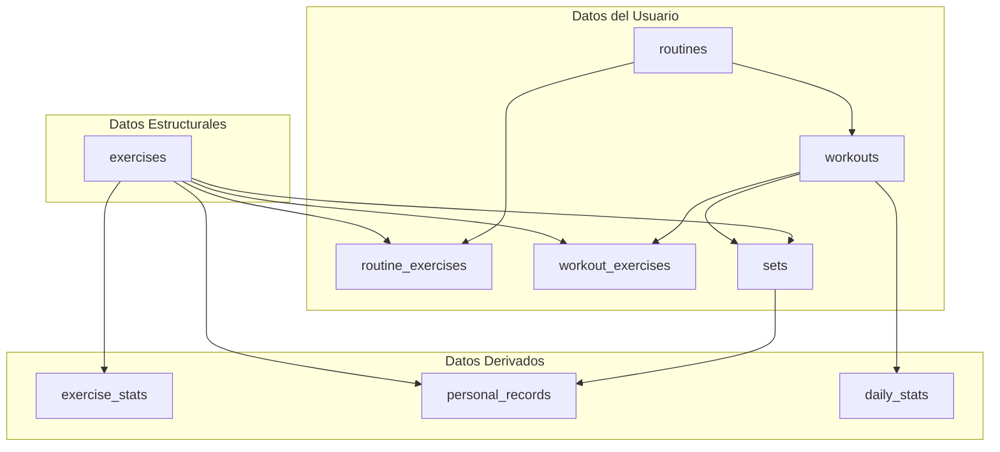
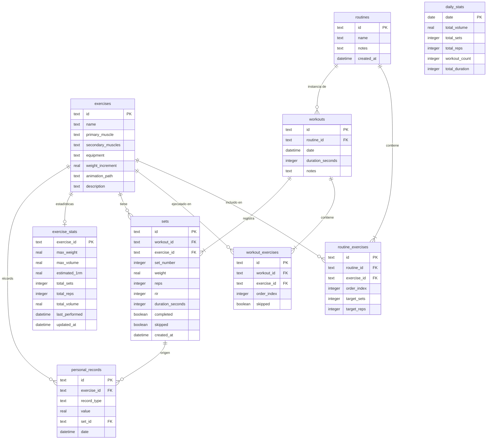
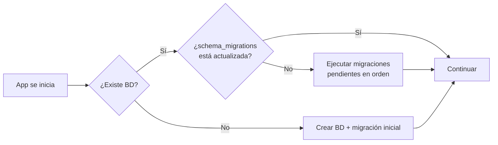
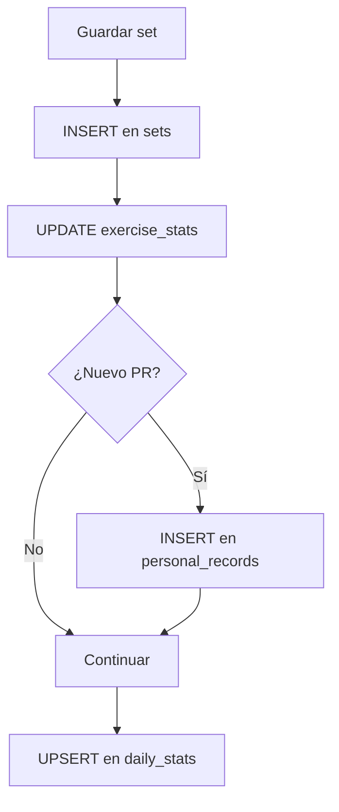

# Especificación Técnica – Base de Datos

## Aplicación Personal de Entrenamiento (estilo Hevy)

---

## 1. Objetivo del sistema de base de datos

El sistema de base de datos debe permitir:

- Registrar entrenamientos de hipertrofia
- Guardar sets, peso, repeticiones y tiempo
- Almacenar rutinas reutilizables
- Mantener estadísticas precalculadas
- Registrar progreso histórico
- Permitir backups completos
- Funcionar completamente **offline**

### Optimizaciones objetivo

| Criterio                         | Prioridad |
| -------------------------------- | --------- |
| Lecturas rápidas en estadísticas | 🔴 Alta   |
| Gran cantidad de sets históricos | 🔴 Alta   |
| Bajo consumo de almacenamiento   | 🟡 Media  |
| Baja latencia                    | 🔴 Alta   |

---

## 2. Motor de base de datos

**SQLite** — Motor seleccionado.

| Razón                                           | Detalle                          |
| ------------------------------------------------ | -------------------------------- |
| Offline nativo                                   | Sin necesidad de servidor        |
| Integrado en Android                             | Disponible out-of-the-box        |
| Extremadamente rápido para apps locales          | Operaciones en microsegundos     |
| Soporte completo SQL                             | Índices, triggers, transacciones |
| Ideal para datasets pequeños a medianos          | Hasta ~1 GB sin problemas        |

### Librería de acceso

En React Native / Expo:

```
expo-sqlite
```

> [!NOTE]
> **Alternativas evaluadas**: `react-native-sqlite-storage`, `WatermelonDB` (si el dataset creciera mucho). Para este proyecto **`expo-sqlite` es suficiente**.

### Configuración inicial

```sql
-- Integridad referencial (obligatorio)
PRAGMA foreign_keys = ON;

-- Mejor rendimiento de escritura/lectura concurrente
PRAGMA journal_mode = WAL;
```

---

## 3. Modelo de datos conceptual

El sistema tiene tres grupos principales de entidades:



---

## 4. Diagrama Entidad-Relación (ERD)



---

## 5. Tablas principales — DDL

### 5.1 `exercises`

Contiene la base de datos de ejercicios disponibles.

- **Propósito**: Catálogo de ejercicios con metadatos
- **Filas estimadas**: ~200–500
- **Índices**: PK auto-indexado

```sql
CREATE TABLE exercises (
    id               TEXT PRIMARY KEY,
    name             TEXT NOT NULL,
    primary_muscle   TEXT NOT NULL,
    secondary_muscles TEXT,        -- JSON array o comma-separated
    equipment        TEXT,
    weight_increment REAL DEFAULT 2.5,
    animation_path   TEXT,         -- ruta relativa al archivo WebP local
    description      TEXT
);
```

> [!NOTE]
> `animation_path` referencia archivos en `assets/exercises/animations/`. Las animaciones **no** se almacenan en la BD para evitar inflarla.

---

### 5.2 `routines`

Plantillas de entrenamiento reutilizables.

- **Propósito**: Definición de rutinas guardadas por el usuario
- **Filas estimadas**: ~10–50

```sql
CREATE TABLE routines (
    id         TEXT PRIMARY KEY,
    name       TEXT NOT NULL,
    notes      TEXT,
    created_at DATETIME DEFAULT (datetime('now'))
);
```

---

### 5.3 `routine_exercises`

Ejercicios incluidos en una rutina (tabla de unión 1:N).

- **Propósito**: Relación entre rutina y ejercicios con orden y metas
- **Índices**: `routine_id`, `exercise_id`

```sql
CREATE TABLE routine_exercises (
    id           TEXT PRIMARY KEY,
    routine_id   TEXT NOT NULL,
    exercise_id  TEXT NOT NULL,
    order_index  INTEGER NOT NULL DEFAULT 0,
    target_sets  INTEGER,
    target_reps  INTEGER,

    FOREIGN KEY (routine_id)  REFERENCES routines(id)  ON DELETE CASCADE,
    FOREIGN KEY (exercise_id) REFERENCES exercises(id) ON DELETE RESTRICT
);

CREATE INDEX idx_routine_exercises_routine  ON routine_exercises(routine_id);
CREATE INDEX idx_routine_exercises_exercise ON routine_exercises(exercise_id);
```

---

### 5.4 `workouts`

Instancias reales de entrenamiento.

- **Propósito**: Registro de sesiones de entrenamiento
- **Filas estimadas**: ~2 000
- **Índices**: `date`, `routine_id`

```sql
CREATE TABLE workouts (
    id               TEXT PRIMARY KEY,
    routine_id       TEXT,
    date             DATETIME NOT NULL DEFAULT (datetime('now')),
    duration_seconds INTEGER DEFAULT 0,
    notes            TEXT,

    FOREIGN KEY (routine_id) REFERENCES routines(id) ON DELETE SET NULL
);

CREATE INDEX idx_workouts_date       ON workouts(date);
CREATE INDEX idx_workouts_routine_id ON workouts(routine_id);
```

---

### 5.5 `workout_exercises`

Ejercicios dentro de un entrenamiento activo.

- **Propósito**: Relación entre workout y ejercicios ejecutados
- **Índices**: `workout_id`, `exercise_id`

```sql
CREATE TABLE workout_exercises (
    id          TEXT PRIMARY KEY,
    workout_id  TEXT NOT NULL,
    exercise_id TEXT NOT NULL,
    order_index INTEGER NOT NULL DEFAULT 0,
    skipped     BOOLEAN DEFAULT 0,

    FOREIGN KEY (workout_id)  REFERENCES workouts(id)  ON DELETE CASCADE,
    FOREIGN KEY (exercise_id) REFERENCES exercises(id) ON DELETE RESTRICT
);

CREATE INDEX idx_workout_exercises_workout  ON workout_exercises(workout_id);
CREATE INDEX idx_workout_exercises_exercise ON workout_exercises(exercise_id);
```

---

### 5.6 `sets`

Registro individual de cada set realizado.

- **Propósito**: Dato atómico de cada serie (peso, reps, tiempo)
- **Filas estimadas**: ~50 000
- **Índices**: `exercise_id`, `workout_id`, `created_at`

```sql
CREATE TABLE sets (
    id               TEXT PRIMARY KEY,
    workout_id       TEXT NOT NULL,
    exercise_id      TEXT NOT NULL,
    set_number       INTEGER NOT NULL,
    weight           REAL DEFAULT 0 CHECK (weight >= 0),
    reps             INTEGER DEFAULT 0 CHECK (reps >= 0),
    rir              INTEGER CHECK (rir >= 0 AND rir <= 10),
    duration_seconds INTEGER DEFAULT 0,   -- para ejercicios por tiempo
    completed        BOOLEAN DEFAULT 0,
    skipped          BOOLEAN DEFAULT 0,
    created_at       DATETIME DEFAULT (datetime('now')),

    FOREIGN KEY (workout_id)  REFERENCES workouts(id)  ON DELETE CASCADE,
    FOREIGN KEY (exercise_id) REFERENCES exercises(id) ON DELETE RESTRICT
);

CREATE INDEX idx_sets_exercise   ON sets(exercise_id);
CREATE INDEX idx_sets_workout    ON sets(workout_id);
CREATE INDEX idx_sets_created_at ON sets(created_at);
```

---

## 6. Tablas de estadísticas precalculadas

> [!IMPORTANT]
> Estas tablas evitan cálculos pesados en tiempo real. Se actualizan mediante lógica de aplicación cada vez que se inserta, modifica o borra un set.

### 6.1 `exercise_stats`

Estadísticas agregadas por ejercicio.

- **Propósito**: Cache de métricas por ejercicio
- **Clave**: `exercise_id` (1:1 con `exercises`)

```sql
CREATE TABLE exercise_stats (
    exercise_id    TEXT PRIMARY KEY,
    max_weight     REAL DEFAULT 0,
    max_volume     REAL DEFAULT 0,       -- max(weight * reps) en un solo set
    estimated_1rm  REAL DEFAULT 0,
    total_sets     INTEGER DEFAULT 0,
    total_reps     INTEGER DEFAULT 0,
    total_volume   REAL DEFAULT 0,       -- sum(weight * reps) total
    last_performed DATETIME,
    updated_at     DATETIME DEFAULT (datetime('now')),

    FOREIGN KEY (exercise_id) REFERENCES exercises(id) ON DELETE CASCADE
);
```

---

### 6.2 `personal_records`

Récords personales categorizados.

- **Propósito**: Historial de PRs por tipo
- **Índices**: `exercise_id`, `record_type`

```sql
CREATE TABLE personal_records (
    id           TEXT PRIMARY KEY,
    exercise_id  TEXT NOT NULL,
    record_type  TEXT NOT NULL CHECK (record_type IN ('max_weight', 'max_reps', 'max_volume', 'estimated_1rm')),
    value        REAL NOT NULL,
    set_id       TEXT,
    date         DATETIME NOT NULL DEFAULT (datetime('now')),

    FOREIGN KEY (exercise_id) REFERENCES exercises(id) ON DELETE CASCADE,
    FOREIGN KEY (set_id)      REFERENCES sets(id)      ON DELETE SET NULL
);

CREATE INDEX idx_personal_records_exercise ON personal_records(exercise_id);
CREATE INDEX idx_personal_records_type     ON personal_records(record_type);
```

---

### 6.3 `daily_stats`

Estadísticas diarias de entrenamiento.

- **Propósito**: Resumen por día para gráficos y métricas rápidas
- **Clave**: `date`

```sql
CREATE TABLE daily_stats (
    date           DATE PRIMARY KEY,
    total_volume   REAL DEFAULT 0,
    total_sets     INTEGER DEFAULT 0,
    total_reps     INTEGER DEFAULT 0,
    workout_count  INTEGER DEFAULT 0,
    total_duration INTEGER DEFAULT 0     -- en segundos
);
```

---

## 7. Estrategia de índices

Los índices están diseñados para optimizar las consultas más frecuentes:

| Índice                             | Tabla               | Columna(s)      | Justificación                           |
| ---------------------------------- | -------------------- | --------------- | --------------------------------------- |
| `idx_sets_exercise`                | `sets`               | `exercise_id`   | Consultas de historial por ejercicio    |
| `idx_sets_workout`                 | `sets`               | `workout_id`    | Carga de sets de un workout             |
| `idx_sets_created_at`              | `sets`               | `created_at`    | Consultas por rango de fechas           |
| `idx_workouts_date`                | `workouts`           | `date`          | Listado cronológico de entrenamientos   |
| `idx_workouts_routine_id`          | `workouts`           | `routine_id`    | Filtrar workouts por rutina             |
| `idx_routine_exercises_routine`    | `routine_exercises`  | `routine_id`    | Carga de ejercicios de una rutina       |
| `idx_routine_exercises_exercise`   | `routine_exercises`  | `exercise_id`   | Buscar en qué rutinas está un ejercicio |
| `idx_workout_exercises_workout`    | `workout_exercises`  | `workout_id`    | Carga de ejercicios de un workout       |
| `idx_workout_exercises_exercise`   | `workout_exercises`  | `exercise_id`   | Historial de un ejercicio por workout   |
| `idx_personal_records_exercise`    | `personal_records`   | `exercise_id`   | PRs por ejercicio                       |
| `idx_personal_records_type`        | `personal_records`   | `record_type`   | Filtrar por tipo de récord              |

> [!TIP]
> Los Primary Keys en SQLite generan índice automáticamente. No se crean índices adicionales en tablas pequeñas (`exercises`, `routines`) para evitar overhead de escritura innecesario.

---

## 8. Estrategia de migraciones

### Tabla de control de versiones

```sql
CREATE TABLE schema_migrations (
    version    INTEGER PRIMARY KEY,
    applied_at DATETIME DEFAULT (datetime('now'))
);
```

### Flujo de migración



### Reglas de migración

1. Cada cambio estructural crea una nueva migración
2. La versión se incrementa secuencialmente
3. Las migraciones se ejecutan automáticamente al iniciar la app
4. Cada migración **debe ser idempotente** y envuelta en transacción

### Ejemplo: Migración inicial

```sql
-- migrations/001_initial_schema.sql
BEGIN;

-- Todas las tablas definidas en la sección 5 y 6
-- ...

INSERT INTO schema_migrations (version) VALUES (1);

COMMIT;
```

---

## 9. Flujo de actualización de estadísticas

Cuando se **guarda un set**:



> [!WARNING]
> Todo este flujo **debe ejecutarse dentro de una transacción** para garantizar consistencia. Si algún paso falla, se debe hacer rollback completo.

---

## 10. Integridad de datos

### Constraints aplicados

| Tipo            | Aplicación                                                   |
| --------------- | ------------------------------------------------------------ |
| **PRIMARY KEY** | Toda tabla tiene PK definida                                 |
| **FOREIGN KEY** | Todas las relaciones usan FK explícitas                      |
| **NOT NULL**    | Columnas requeridas marcadas                                 |
| **CHECK**       | `weight >= 0`, `reps >= 0`, `record_type IN (...)`           |
| **DEFAULT**     | Timestamps, valores numéricos iniciales                      |
| **ON DELETE**   | `CASCADE` para datos hijos, `SET NULL` para refs opcionales  |

### Estrategia de borrado

Cuando se borra un **workout**:

1. Borrar `sets` asociados (CASCADE)
2. Borrar `workout_exercises` asociados (CASCADE)
3. Recalcular `exercise_stats` para cada ejercicio afectado
4. Recalcular `daily_stats` del día correspondiente

> [!CAUTION]
> El borrado y recálculo **debe ejecutarse en una sola transacción** para evitar datos inconsistentes.

---

## 11. Estrategia de backups

Los backups se realizan en formato **JSON** y se suben a **Google Drive**.

### Estructura del backup

```json
{
  "version": 1,
  "created_at": "2025-01-15T10:30:00Z",
  "data": {
    "exercises": [],
    "routines": [],
    "routine_exercises": [],
    "workouts": [],
    "workout_exercises": [],
    "sets": [],
    "exercise_stats": [],
    "personal_records": [],
    "daily_stats": []
  }
}
```

### Política de retención

- **1 backup actual** + **1 backup anterior**
- Subida a Google Drive API

---

## 12. Estimaciones de tamaño

| Tabla              | Filas estimadas  | Tamaño estimado |
| ------------------ | ---------------- | --------------- |
| `exercises`        | ~200–500         | < 100 KB        |
| `routines`         | ~10–50           | < 10 KB         |
| `routine_exercises`| ~50–250          | < 50 KB         |
| `workouts`         | ~2 000           | ~200 KB         |
| `workout_exercises`| ~10 000          | ~1 MB           |
| `sets`             | ~50 000          | ~5 MB           |
| `exercise_stats`   | ~200–500         | < 100 KB        |
| `personal_records` | ~1 000–5 000     | ~500 KB         |
| `daily_stats`      | ~700–1 500       | < 200 KB        |
| **Total estimado** |                  | **10–30 MB**    |

> [!TIP]
> SQLite maneja bases de datos de este tamaño sin ningún problema, incluso con años de uso intensivo.

---

## 13. Optimización futura

Si el historial crece significativamente:

```sql
-- Tabla de estadísticas mensuales para agregaciones rápidas
CREATE TABLE monthly_stats (
    year           INTEGER NOT NULL,
    month          INTEGER NOT NULL,
    total_volume   REAL DEFAULT 0,
    total_sets     INTEGER DEFAULT 0,
    total_reps     INTEGER DEFAULT 0,
    workout_count  INTEGER DEFAULT 0,
    total_duration INTEGER DEFAULT 0,

    PRIMARY KEY (year, month)
);
```

---

## 14. Almacenamiento de animaciones

```
assets/
└── exercises/
    └── animations/
        ├── bench_press.webp
        ├── squat.webp
        └── deadlift.webp
```

La BD solo almacena la **ruta relativa** en `exercises.animation_path`. Las animaciones se sirven desde el filesystem para evitar inflar la base de datos.
