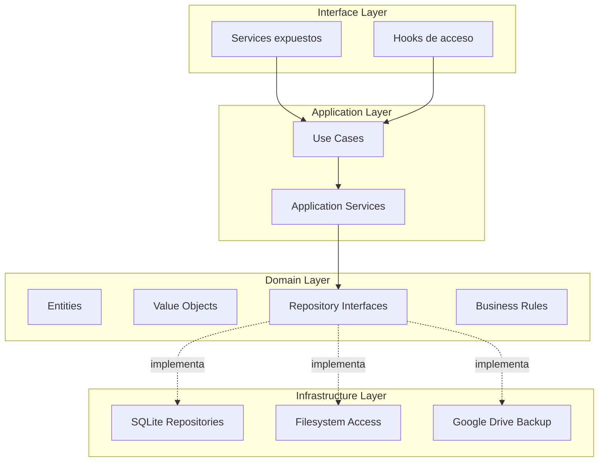
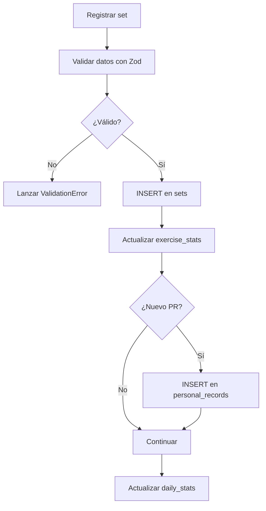
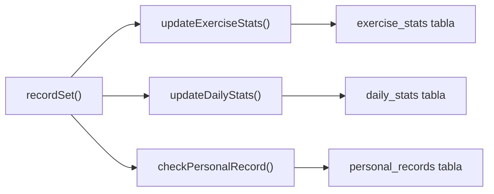
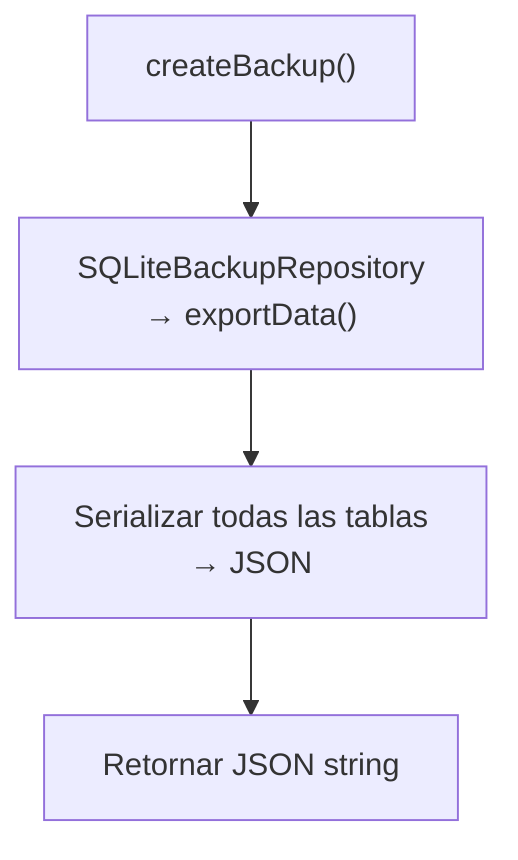
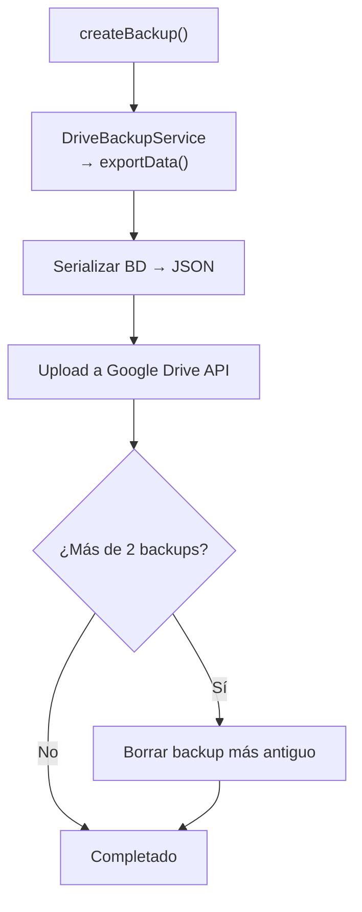

# Especificación Técnica – Backend

## Aplicación Personal de Entrenamiento (estilo Hevy)

---

## 1. Objetivo del Backend

El backend de la aplicación será una **capa lógica local embebida** encargada de:

- Manejar la lógica de negocio
- Interactuar con la base de datos SQLite
- Calcular estadísticas
- Generar recomendaciones de peso
- Administrar backups
- Exponer servicios al frontend

> [!IMPORTANT]
> A diferencia de una arquitectura cliente-servidor tradicional, este backend está **embebido dentro de la aplicación móvil**. No habrá servidor remoto. Toda la lógica corre en el dispositivo.

---

## 2. Filosofía de diseño

| Principio | Descripción |
| --- | --- |
| **Offline-first** | Funcionalidad completa sin conexión a internet |
| **Alta cohesión** | Cada módulo tiene una responsabilidad bien definida |
| **Bajo acoplamiento** | Las capas se comunican solo mediante interfaces |
| **Separación lógica/UI** | La lógica de negocio **nunca** vive en el frontend |
| **Facilidad de testeo** | Toda la lógica es testeable de forma aislada |
| **Type-first development** | Los tipos definen el contrato antes de la implementación |

---

## 3. Lenguaje y entorno

**TypeScript** — ejecutado dentro del entorno de React Native / Expo.

| Ventaja | Impacto |
| --- | --- |
| Tipado fuerte | Menos errores en tiempo de ejecución |
| Mejor mantenibilidad | Refactoring seguro con soporte del IDE |
| Discriminated unions | Estados ilegales irrepresentables |
| Integración con frontend | Mismo lenguaje en toda la aplicación |

### Modo estricto obligatorio

```json
// tsconfig.json (parcial)
{
  "compilerOptions": {
    "strict": true,
    "noUncheckedIndexedAccess": true,
    "exactOptionalPropertyTypes": true
  }
}
```

---

## 4. Arquitectura

Se utiliza **Clean Architecture + Domain Driven Design (DDD ligero)**.

### Diagrama de capas



### Flujo de datos


> [!WARNING]
> El frontend **no debe** interactuar directamente con SQLite. Todo el acceso a datos pasa por las capas intermedias.

---

## 5. Capas del sistema

### 5.1 Domain Layer

La capa más interna. **No depende de ninguna otra capa.**

Contiene:

- **Entities**: objetos de negocio con identidad
- **Value Objects**: objetos inmutables sin identidad
- **Repository Interfaces**: contratos de acceso a datos
- **Business Rules**: validaciones y reglas de dominio
- **Domain Services**: utilidades del dominio (Logger)

---

### 5.2 Application Layer

Orquesta los casos de uso del sistema.

Contiene:

- **Use Cases**: acciones concretas del usuario (29 use cases)
- **Application Services**: lógica de coordinación (StatsCalculator)

---

### 5.3 Infrastructure Layer

Implementaciones concretas de las interfaces del dominio.

Contiene:

- **SQLite Repositories**: 7 repositorios de acceso a datos
- **Database**: conexión, migraciones (22) y seeds
- **Backup**: Google Drive integration (stub, futuro)
- **DI Container**: fábrica de dependencias
- **Scripts**: importación y mapeo de datos wger
- **Services**: ConsoleLogger

---

### 5.4 Interface Layer

Puente entre el frontend y la lógica de negocio.

Contiene:

- **Services**: 7 facades que agrupan use cases por dominio
- **Hooks**: 8 React hooks que consumen los services via contexto

---

## 6. Entidades del dominio

### `Exercise`

```typescript
import type { MuscleGroup } from '../valueObjects/MuscleGroup';
import type { Equipment } from '../valueObjects/Equipment';

type ExerciseType = 'compound' | 'isolation';

interface Exercise {
  readonly id: string;
  name: string;
  primaryMuscles: MuscleGroup[];
  secondaryMuscles: MuscleGroup[];
  equipment: Equipment;
  exerciseType: ExerciseType;
  weightIncrement: number;
  animationPath: string | null;
  description: string | null;
  anatomicalRepresentationSvg: string | null;
}
```

---

### `Routine`

```typescript
interface Routine {
  readonly id: string;
  name: string;
  notes: string | null;
  exercises: RoutineExercise[];
  createdAt: Date;
}

interface RoutineExercise {
  readonly id: string;
  exerciseId: string;
  orderIndex: number;
  targetSets: number;
  minReps: number;          // Bottom of the rep range (e.g. 8 in "8-12")
  maxReps: number;          // Top of the rep range (e.g. 12 in "8-12")
  restSeconds: number | null;
  supersetGroup: number | null;
}
```

---

### `Workout`

```typescript
interface Workout {
  readonly id: string;
  routineId: string | null;
  date: Date;
  durationSeconds: number;
  notes: string | null;
  exercises: WorkoutExercise[];
}

interface WorkoutExercise {
  readonly id: string;
  exerciseId: string;
  orderIndex: number;
  skipped: boolean;
  notes: string | null;
  supersetGroup: number | null;
  sets: WorkoutSet[];
}
```

---

### `WorkoutSet`

```typescript
import type { SetType } from '../valueObjects/SetType';

interface WorkoutSet {
  readonly id: string;
  exerciseId: string;
  setNumber: number;
  weight: number;
  reps: number;
  rir: number | null;
  setType: SetType;           // 'normal' | 'warmup' | 'dropset' | 'failure'
  restSeconds: number | null;
  durationSeconds: number;
  completed: boolean;
  skipped: boolean;
  createdAt: Date;
}
```

---

### `ExerciseStats`

```typescript
interface ExerciseStats {
  exerciseId: string;
  maxWeight: number;
  maxVolume: number;
  maxReps: number;
  estimated1RM: number;
  totalSets: number;
  totalReps: number;
  totalVolume: number;
  lastPerformed: Date | null;
  updatedAt: Date;
}
```

---

### `PersonalRecord`

```typescript
interface PersonalRecord {
  readonly id: string;
  exerciseId: string;
  recordType: RecordType;     // 'max_weight' | 'max_reps' | 'max_volume' | 'estimated_1rm'
  value: number;
  setId: string | null;
  date: Date;
}
```

---

### `DailyStats`

```typescript
interface DailyStats {
  date: string;               // 'YYYY-MM-DD'
  totalVolume: number;
  totalSets: number;
  totalReps: number;
  workoutCount: number;
  totalDuration: number;      // in seconds
}
```

---

### `UserPreferences`

```typescript
interface UserPreferences {
  weightUnit: 'kg' | 'lbs';
  theme: 'light' | 'dark' | 'system';
  defaultRestSeconds: number;
}
```

---

### `BodyWeightEntry`

```typescript
interface BodyWeightEntry {
  readonly id: string;
  weight: number;
  date: Date;
  notes: string | null;
  createdAt: Date;
}
```

---

## 7. Value Objects

### `MuscleGroup`

```typescript
const MUSCLE_GROUPS = [
  'chest', 'back', 'shoulders', 'biceps', 'triceps',
  'forearms', 'quadriceps', 'hamstrings', 'glutes',
  'calves', 'abs', 'traps',
] as const;

type MuscleGroup = typeof MUSCLE_GROUPS[number];
```

### `Equipment`

```typescript
const EQUIPMENT = [
  'barbell', 'dumbbell', 'machine', 'cable',
  'bodyweight', 'band', 'other',
] as const;

type Equipment = typeof EQUIPMENT[number];
```

### `SetType`

```typescript
const SET_TYPES = ['normal', 'warmup', 'dropset', 'failure'] as const;

type SetType = typeof SET_TYPES[number];
```

### `SessionContext`

```typescript
type ActivationLevel = 'hot' | 'warm' | 'cold';

class SessionContext {
  markAsPrimary(muscles: MuscleGroup[]): void;
  markAsSecondary(muscles: MuscleGroup[]): void;
  getState(muscle: MuscleGroup): ActivationLevel;
  getColdestState(muscles: MuscleGroup[]): ActivationLevel;
  getAllStates(): Record<string, ActivationLevel>;
  reset(): void;
}
```

---

## 8. Validación con Zod

Los esquemas de Zod son **la fuente de verdad** para validación en tiempo de ejecución.

### Schemas disponibles

| Archivo | Contenido |
| --- | --- |
| `workoutSchemas.ts` | WorkoutSetSchema, CreateWorkoutInput, etc. |
| `exerciseSchemas.ts` | CreateExerciseSchema, validación de ejercicios |
| `bodyWeightSchemas.ts` | BodyWeightEntrySchema |
| `preferencesSchemas.ts` | PreferenceUpdateSchema |
| `backupSchemas.ts` | BackupDataSchema, validación de JSON importado |

```typescript
// Ejemplo: shared/schemas/workoutSchemas.ts
import { z } from 'zod';

export const WorkoutSetSchema = z.object({
  exerciseId: z.string().uuid(),
  setNumber: z.number().int().positive(),
  weight: z.number().min(0, 'El peso no puede ser negativo'),
  reps: z.number().int().min(0, 'Las reps no pueden ser negativas'),
  rir: z.number().int().min(0).max(10).nullable().default(null),
  durationSeconds: z.number().int().min(0).default(0),
  completed: z.boolean().default(false),
  skipped: z.boolean().default(false),
});

export type CreateSetInput = z.infer<typeof WorkoutSetSchema>;
```

---

## 9. Repository Interfaces

Los repositorios abstraen el acceso a la base de datos. Se definen como **interfaces en el dominio** y se implementan en infraestructura.

### Repositorios del sistema

| Interface (Domain) | Implementación (Infra) | Responsabilidad |
| --- | --- | --- |
| `ExerciseRepository` | `SQLiteExerciseRepository` | CRUD de ejercicios, búsqueda, filtrado por músculo |
| `WorkoutRepository` | `SQLiteWorkoutRepository` | CRUD de workouts, sets, historial de ejercicios |
| `RoutineRepository` | `SQLiteRoutineRepository` | CRUD de rutinas |
| `StatsRepository` | `SQLiteStatsRepository` | Estadísticas, PRs, balance muscular, daily stats |
| `UserPreferencesRepository` | `SQLiteUserPreferencesRepository` | Preferencias del usuario |
| `BodyWeightRepository` | `SQLiteBodyWeightRepository` | Historial de peso corporal |
| `BackupRepository` | `SQLiteBackupRepository` | Export/import de datos, CSV |

```typescript
// Ejemplo: domain/repositories/ExerciseRepository.ts
interface ExerciseRepository {
  getAll(): Promise<Exercise[]>;
  getById(id: string): Promise<Exercise | null>;
  search(query: string): Promise<Exercise[]>;
  getByMuscleGroup(muscle: string): Promise<Exercise[]>;
  isInUse(id: string): Promise<boolean>;
  save(exercise: Exercise): Promise<void>;
  delete(id: string): Promise<void>;
}

// Ejemplo: domain/repositories/WorkoutRepository.ts
interface WorkoutRepository {
  getById(id: string): Promise<Workout | null>;
  getByDateRange(start: Date, end: Date): Promise<Workout[]>;
  getRecent(limit: number): Promise<Workout[]>;
  save(workout: Workout): Promise<void>;
  delete(id: string): Promise<void>;
  addSet(workoutId: string, exerciseId: string, set: WorkoutSet): Promise<void>;
  updateSet(workoutId: string, set: WorkoutSet): Promise<void>;
  deleteSet(workoutId: string, setId: string): Promise<void>;
  markExerciseSkipped(workoutId: string, exerciseId: string, skipped: boolean): Promise<void>;
  addExercise(workoutId: string, exercise: WorkoutExercise): Promise<void>;
  reorderExercises(workoutId: string, exerciseIds: string[]): Promise<void>;
  getExerciseHistory(exerciseId: string, limit?: number): Promise<WorkoutSet[]>;
}

// Ejemplo: domain/repositories/StatsRepository.ts
interface StatsRepository {
  getExerciseStats(exerciseId: string): Promise<ExerciseStats | null>;
  deleteExerciseStats(exerciseId: string): Promise<void>;
  recalculateExerciseStats(exerciseId: string): Promise<ExerciseStats | null>;
  updateExerciseStats(stats: ExerciseStats): Promise<void>;
  getDailyStats(date: string): Promise<DailyStats | null>;
  getDailyStatsRange(startDate: string, endDate: string): Promise<DailyStats[]>;
  getWeeklyStats(startDate: string, endDate: string): Promise<DailyStats[]>;
  deleteDailyStats(date: string): Promise<void>;
  recalculateDailyStats(date: string): Promise<DailyStats | null>;
  upsertDailyStats(stats: DailyStats): Promise<void>;
  getPersonalRecords(exerciseId: string): Promise<PersonalRecord[]>;
  getLatestRecord(exerciseId: string, recordType: string): Promise<PersonalRecord | null>;
  savePersonalRecord(record: PersonalRecord): Promise<void>;
  getMuscleVolumeDistribution(startDate: string, endDate: string): Promise<{ muscle: string; volume: number; sets: number }[]>;
}
```

---

## 10. Casos de uso (Application Layer)

Cada caso de uso encapsula **una acción concreta** del sistema.

### Workouts (10 use cases)

| Use Case | Descripción |
| --- | --- |
| `StartWorkout` | Crear workout desde rutina o vacío |
| `FinishWorkout` | Finalizar workout, calcular duración |
| `DeleteWorkoutUseCase` | Eliminar workout y recalcular stats |
| `RecordSet` | Registrar set, actualizar stats y PRs |
| `UpdateSetUseCase` | Modificar un set existente |
| `DeleteSetUseCase` | Eliminar set y recalcular stats |
| `SkipExercise` | Marcar ejercicio como saltado |
| `AddExerciseToWorkoutUseCase` | Agregar ejercicio a workout en curso |
| `ReorderWorkoutExercisesUseCase` | Reordenar ejercicios del workout |
| `SuggestWeight` | Sugerir peso + calentamiento inteligente |

### Exercises (4 use cases)

| Use Case | Descripción |
| --- | --- |
| `CreateExerciseUseCase` | Crear ejercicio personalizado |
| `UpdateExerciseUseCase` | Actualizar ejercicio |
| `DeleteExerciseUseCase` | Eliminar ejercicio (verifica uso) |
| `GetExerciseHistoryUseCase` | Historial de sets de un ejercicio |

### Routines (4 use cases)

| Use Case | Descripción |
| --- | --- |
| `CreateRoutineUseCase` | Crear rutina nueva |
| `UpdateRoutineUseCase` | Actualizar rutina existente |
| `DeleteRoutineUseCase` | Eliminar rutina |
| `DuplicateRoutineUseCase` | Duplicar rutina existente |

### Statistics (3 use cases)

| Use Case | Descripción |
| --- | --- |
| `GetWeeklyStatsUseCase` | Estadísticas por rango de fechas |
| `GetMuscleBalanceUseCase` | Distribución de volumen por músculo |
| `GetTrainingFrequencyUseCase` | Frecuencia de entrenamiento |

### Preferences (2 use cases)

| Use Case | Descripción |
| --- | --- |
| `GetPreferencesUseCase` | Obtener preferencias del usuario |
| `UpdatePreferenceUseCase` | Actualizar una preferencia |

### Body Weight (2 use cases)

| Use Case | Descripción |
| --- | --- |
| `LogBodyWeightUseCase` | Registrar peso corporal |
| `GetBodyWeightHistoryUseCase` | Historial de peso corporal |

### Backup (3 use cases)

| Use Case | Descripción |
| --- | --- |
| `CreateBackupUseCase` | Exportar BD a JSON |
| `RestoreBackupUseCase` | Restaurar BD desde JSON |
| `ExportCSVUseCase` | Exportar datos a CSV |

### Application Services (1)

| Service | Descripción |
| --- | --- |
| `StatsCalculator` | Cálculo de 1RM (Epley), volumen, detección de PRs |

---

### Flujo de `RecordSet` (ejemplo detallado)



### Flujo de `SuggestWeight` (Doble Progresión)

Ver detalle completo del algoritmo en `sobrecarga progresiva.md`.

---

## 11. Servicios del sistema (Interface Layer)

Los services son la **interfaz pública** que el frontend consume.

| Service | Métodos | Use Cases que orquesta |
| --- | --- | --- |
| `WorkoutService` | 11 métodos | StartWorkout, FinishWorkout, DeleteWorkout, RecordSet, UpdateSet, DeleteSet, SkipExercise, AddExerciseToWorkout, ReorderWorkoutExercises, SuggestWeight |
| `ExerciseService` | 4 métodos | CreateExercise, UpdateExercise, DeleteExercise, GetExerciseHistory |
| `RoutineService` | 4 métodos | CreateRoutine, UpdateRoutine, DeleteRoutine, DuplicateRoutine |
| `StatsService` | 3 métodos | GetWeeklyStats, GetMuscleBalance, GetTrainingFrequency |
| `BackupService` | 3 métodos | CreateBackup, RestoreBackup, ExportCSV |
| `PreferencesService` | 2 métodos | GetPreferences, UpdatePreference |
| `BodyWeightService` | 2 métodos | LogBodyWeight, GetBodyWeightHistory |

---

## 12. React Hooks (Interface Layer)

Los hooks son el puente entre los services del backend y los componentes React Native.

### `useContainer`

```typescript
// Context + Provider para inyectar el AppContainer en el árbol React.
// Uso:
const container = createContainer(db);

<ContainerProvider container={container}>
  <App />
</ContainerProvider>
```

### Hooks disponibles

| Hook | Service que wrappea | Métodos expuestos |
| --- | --- | --- |
| `useWorkout()` | WorkoutService | startWorkout, finishWorkout, deleteWorkout, recordSet, updateSet, deleteSet, skipExercise, addExerciseToWorkout, reorderWorkoutExercises, suggestWeight, suggestWarmup |
| `useExercises()` | ExerciseService | createExercise, updateExercise, deleteExercise, getExerciseHistory |
| `useRoutines()` | RoutineService | createRoutine, updateRoutine, deleteRoutine, duplicateRoutine |
| `useStats()` | StatsService | getWeeklyStats, getMuscleBalance, getTrainingFrequency |
| `useBodyWeight()` | BodyWeightService | logBodyWeight, getBodyWeightHistory |
| `usePreferences()` | PreferencesService | getPreferences, updatePreference |
| `useBackup()` | BackupService | createBackup, restoreBackup, exportCSV |

Todos los hooks utilizan `useCallback` y `useMemo` para estabilidad referencial.

```typescript
// Ejemplo de uso en un componente:
function WorkoutScreen() {
  const { startWorkout, recordSet, suggestWeight } = useWorkout();
  const { getWeeklyStats } = useStats();

  // ...
}
```

---

## 13. Manejo de errores

Errores estructurados con jerarquía de clases:

```typescript
// shared/errors.ts

abstract class AppError extends Error {
  abstract readonly code: string;
  abstract readonly statusCode: number;

  constructor(message: string, public readonly details?: unknown) {
    super(message);
    this.name = this.constructor.name;
  }
}

class DomainError extends AppError {
  readonly code = 'DOMAIN_ERROR';
  readonly statusCode = 400;
}

class ValidationError extends AppError {
  readonly code = 'VALIDATION_ERROR';
  readonly statusCode = 422;

  constructor(message: string, public readonly fieldErrors: Record<string, string[]>) {
    super(message, fieldErrors);
  }
}

class NotFoundError extends AppError {
  readonly code = 'NOT_FOUND';
  readonly statusCode = 404;
}

class DatabaseError extends AppError {
  readonly code = 'DATABASE_ERROR';
  readonly statusCode = 500;
}
```

> [!TIP]
> **Exhaustive error handling**: Cada capa propaga errores con contexto. Nunca se traguen errores silenciosamente.

---

## 14. Estrategia de transacciones

Las operaciones críticas **deben ejecutarse en transacciones** para asegurar consistencia.

```typescript
async function recordSetTransaction(
  db: SQLiteDatabase,
  workoutId: string,
  set: WorkoutSet,
): Promise<void> {
  await db.withTransactionAsync(async () => {
    // 1. Insertar set
    await db.runAsync('INSERT INTO sets (...) VALUES (...)', [/* params */]);
    // 2. Actualizar estadísticas del ejercicio
    await db.runAsync('UPDATE exercise_stats SET ... WHERE exercise_id = ?', [set.exerciseId]);
    // 3. Verificar y guardar PR
    // 4. Actualizar estadísticas diarias
  });
}
```

> [!CAUTION]
> Si algún paso dentro de la transacción falla, **todo el bloque se revierte automáticamente**. Nunca hacer operaciones multi-tabla sin transacción.

---

## 15. Dependency Injection

El sistema utiliza un **contenedor manual** en `infrastructure/di/container.ts` (re-exportado desde `shared/container.ts` por retrocompatibilidad).

```typescript
export interface AppContainer {
  readonly exerciseService: ExerciseService;
  readonly routineService: RoutineService;
  readonly workoutService: WorkoutService;
  readonly statsService: StatsService;
  readonly backupService: BackupService;
  readonly preferencesService: PreferencesService;
  readonly bodyWeightService: BodyWeightService;
}

export function createContainer(db: SQLiteDatabase): AppContainer {
  // 1. Repositories (7)
  const exerciseRepo = new SQLiteExerciseRepository(db);
  const routineRepo = new SQLiteRoutineRepository(db);
  const workoutRepo = new SQLiteWorkoutRepository(db);
  const statsRepo = new SQLiteStatsRepository(db);
  const preferencesRepo = new SQLiteUserPreferencesRepository(db);
  const bodyWeightRepo = new SQLiteBodyWeightRepository(db);
  const backupRepo = new SQLiteBackupRepository(db);

  // 2. Wire Use Cases → Services (7)
  const exerciseService = new ExerciseService(/* use cases */);
  const routineService = new RoutineService(/* use cases */);
  const workoutService = new WorkoutService(/* use cases */);
  const statsService = new StatsService(/* use cases */);
  const backupService = new BackupService(/* use cases */);
  const preferencesService = new PreferencesService(/* use cases */);
  const bodyWeightService = new BodyWeightService(/* use cases */);

  return { exerciseService, routineService, workoutService, statsService, backupService, preferencesService, bodyWeightService };
}
```

---

## 16. Arquitectura de carpetas

```text
src/
├── domain/
│   ├── entities/
│   │   ├── Exercise.ts
│   │   ├── Workout.ts
│   │   ├── WorkoutSet.ts
│   │   ├── Routine.ts
│   │   ├── ExerciseStats.ts
│   │   ├── PersonalRecord.ts
│   │   ├── DailyStats.ts
│   │   ├── UserPreferences.ts
│   │   ├── BodyWeightEntry.ts
│   │   └── index.ts
│   ├── repositories/
│   │   ├── ExerciseRepository.ts
│   │   ├── WorkoutRepository.ts
│   │   ├── RoutineRepository.ts
│   │   ├── StatsRepository.ts
│   │   ├── UserPreferencesRepository.ts
│   │   ├── BodyWeightRepository.ts
│   │   ├── BackupRepository.ts
│   │   └── index.ts
│   ├── services/
│   │   └── Logger.ts
│   └── valueObjects/
│       ├── MuscleGroup.ts
│       ├── Equipment.ts
│       ├── SetType.ts
│       └── SessionContext.ts
│
├── application/
│   ├── useCases/
│   │   ├── StartWorkout.ts
│   │   ├── FinishWorkout.ts
│   │   ├── DeleteWorkoutUseCase.ts
│   │   ├── RecordSet.ts
│   │   ├── UpdateSetUseCase.ts
│   │   ├── DeleteSetUseCase.ts
│   │   ├── SkipExercise.ts
│   │   ├── AddExerciseToWorkoutUseCase.ts
│   │   ├── ReorderWorkoutExercisesUseCase.ts
│   │   ├── SuggestWeight.ts
│   │   ├── CreateExerciseUseCase.ts
│   │   ├── UpdateExerciseUseCase.ts
│   │   ├── DeleteExerciseUseCase.ts
│   │   ├── GetExerciseHistoryUseCase.ts
│   │   ├── CreateRoutineUseCase.ts
│   │   ├── UpdateRoutineUseCase.ts
│   │   ├── DeleteRoutineUseCase.ts
│   │   ├── DuplicateRoutineUseCase.ts
│   │   ├── GetWeeklyStatsUseCase.ts
│   │   ├── GetMuscleBalanceUseCase.ts
│   │   ├── GetTrainingFrequencyUseCase.ts
│   │   ├── GetPreferencesUseCase.ts
│   │   ├── UpdatePreferenceUseCase.ts
│   │   ├── LogBodyWeightUseCase.ts
│   │   ├── GetBodyWeightHistoryUseCase.ts
│   │   ├── CreateBackupUseCase.ts
│   │   ├── RestoreBackupUseCase.ts
│   │   ├── ExportCSVUseCase.ts
│   │   └── __tests__/
│   │       └── SuggestWeight.test.ts
│   └── services/
│       ├── StatsCalculator.ts
│       └── __tests__/
│           └── StatsCalculator.test.ts
│
├── infrastructure/
│   ├── database/
│   │   ├── connection.ts
│   │   ├── migrations/
│   │   │   ├── 001_schema_migrations.ts
│   │   │   ├── 002_exercises.ts
│   │   │   ├── 003_routines.ts
│   │   │   ├── 004_routine_exercises.ts
│   │   │   ├── 005_workouts.ts
│   │   │   ├── 006_workout_exercises.ts
│   │   │   ├── 007_sets.ts
│   │   │   ├── 008_exercise_stats.ts
│   │   │   ├── 009_personal_records.ts
│   │   │   ├── 010_daily_stats.ts
│   │   │   ├── 011_add_rir_and_rep_range.ts
│   │   │   ├── 012_add_anatomical_svg_to_exercises.ts
│   │   │   ├── 013_seed_wger_exercises.ts
│   │   │   ├── 014_add_set_type.ts
│   │   │   ├── 015_add_workout_exercise_notes.ts
│   │   │   ├── 016_add_rest_seconds.ts
│   │   │   ├── 017_user_preferences.ts
│   │   │   ├── 018_body_weight_log.ts
│   │   │   ├── 019_superset_groups.ts
│   │   │   ├── 020_add_max_reps.ts
│   │   │   ├── 021_primary_muscles_array.ts
│   │   │   ├── 022_fix_exercise_muscles.ts
│   │   │   └── index.ts
│   │   └── seeds/
│   ├── repositories/
│   │   ├── SQLiteExerciseRepository.ts
│   │   ├── SQLiteWorkoutRepository.ts
│   │   ├── SQLiteRoutineRepository.ts
│   │   ├── SQLiteStatsRepository.ts
│   │   ├── SQLiteUserPreferencesRepository.ts
│   │   ├── SQLiteBodyWeightRepository.ts
│   │   └── SQLiteBackupRepository.ts
│   ├── di/
│   │   └── container.ts
│   ├── backup/
│   │   └── DriveBackupService.ts
│   ├── scripts/
│   │   ├── wgerMapper.ts
│   │   ├── importWgerData.ts
│   │   ├── seed_wger.ts
│   │   └── __tests__/
│   │       └── wgerMapper.test.ts
│   └── services/
│       └── ConsoleLogger.ts
│
├── interface/
│   ├── services/
│   │   ├── WorkoutService.ts
│   │   ├── ExerciseService.ts
│   │   ├── RoutineService.ts
│   │   ├── StatsService.ts
│   │   ├── BackupService.ts
│   │   ├── PreferencesService.ts
│   │   └── BodyWeightService.ts
│   └── hooks/
│       ├── useContainer.ts
│       ├── useWorkout.ts
│       ├── useExercises.ts
│       ├── useRoutines.ts
│       ├── useStats.ts
│       ├── useBodyWeight.ts
│       ├── usePreferences.ts
│       ├── useBackup.ts
│       └── index.ts
│
└── shared/
    ├── container.ts
    ├── errors.ts
    ├── types.ts
    ├── utils/
    │   ├── generateId.ts
    │   ├── dateUtils.ts
    │   └── Logger.ts
    └── schemas/
        ├── workoutSchemas.ts
        ├── exerciseSchemas.ts
        ├── bodyWeightSchemas.ts
        ├── preferencesSchemas.ts
        └── backupSchemas.ts
```

---

## 17. Dependencias

| Paquete | Uso | Justificación |
| --- | --- | --- |
| `expo-sqlite` | Acceso a SQLite | Integración nativa con Expo |
| `zod` | Validación de datos | Source of truth + type inference |
| `date-fns` | Manipulación de fechas | Inmutable, tree-shakeable, ligero |
| `expo-crypto` | Generación de UUIDs | Mucho más rápido que UUID nativo de JS |

---

## 18. Estrategia de testing

### Herramientas

| Herramienta | Tipo de test |
| --- | --- |
| `jest` | Unit tests + integration tests |
| `ts-jest` | Soporte TypeScript para Jest |

### Cobertura objetivo

```text
Target mínimo: 80%
├── Use Cases  → 90%+
├── Services   → 85%+
├── Validators → 95%+
└── Repositories → 70%+ (integración)
```

### Tests existentes

| Test | Cobertura |
| --- | --- |
| `SuggestWeight.test.ts` | Doble progresión, deload, warmup, SessionContext |
| `StatsCalculator.test.ts` | 1RM Epley, volumen, stats acumulados, PRs |
| `wgerMapper.test.ts` | Mapeo de datos wger |

---

## 19. Gestión de estadísticas

Las estadísticas se calculan **en escritura, no en lectura**.



Esto mantiene las consultas de lectura **instantáneas**.

---

## 20. Backups

### Backup Local (MVP)



### Backup Google Drive (Futuro)



> [!NOTE]
> Google Drive integration está implementada como **stub**. Requiere OAuth 2.0 con el scope `drive.appdata`. Se completará en versiones posteriores al MVP.

### Política de retención (futuro)

- **1 backup actual** + **1 backup anterior**
- Formato: JSON exportado de todas las tablas

---

## 21. Logging

El sistema utiliza un **Logger persistente** que escribe a consola y a un archivo local en el dispositivo.

```typescript
// shared/utils/Logger.ts

class Logger {
  debug(message: string, ...args: unknown[]): void;  // Solo en __DEV__
  info(message: string, ...args: unknown[]): void;
  warn(message: string, ...args: unknown[]): void;
  error(message: string, error?: unknown): void;
}

// Uso:
const log = createLogger('WorkoutService');
log.info('Workout iniciado', { routineId: '...' });
```

### Persistencia a disco

- Los logs se acumulan en un **buffer en memoria** y se escriben a `app_logs.txt` cada 2 segundos.
- El archivo se almacena en `FileSystem.documentDirectory` (persistente, accesible para backups).
- **Rotación básica:** Si el archivo supera **1 MB**, se borra y empieza uno nuevo.
- La función `getLogFilePath()` expone la ruta del archivo para que el frontend pueda leerlo o exportarlo.

> [!TIP]
> El Logger usa `expo-file-system/legacy` para escritura asíncrona. El buffer evita degradar el rendimiento por escrituras frecuentes a disco.

---

## 22. Shared Types

El archivo `shared/types.ts` centraliza tipos utilitarios y re-exporta los tipos más usados del dominio:

```typescript
// Utility types
type AsyncResult<T>       // Wraps Promise<{ success, data } | { success, error }>
type Nullable<T>          // T | null
type DateString           // Branded 'YYYY-MM-DD'
type UUID                 // Branded string
type Kilograms            // number alias
type Seconds              // number alias
type CreateInput<T>       // Omit<T, 'id' | 'createdAt'>
type UpdateInput<T>       // Partial<Omit<T, 'id' | 'createdAt'>>

// Re-exports of all entities, value objects, etc.
```

---

## 23. Migraciones de base de datos

El sistema de migraciones es incremental. Cada archivo es idempotente y se ejecuta en orden.

| # | Archivo | Descripción |
| --- | --- | --- |
| 001 | `schema_migrations` | Tabla de control de migraciones |
| 002 | `exercises` | Tabla de ejercicios |
| 003 | `routines` | Tabla de rutinas |
| 004 | `routine_exercises` | Ejercicios dentro de rutinas |
| 005 | `workouts` | Tabla de entrenamientos |
| 006 | `workout_exercises` | Ejercicios dentro de entrenamientos |
| 007 | `sets` | Sets realizados |
| 008 | `exercise_stats` | Estadísticas pre-calculadas |
| 009 | `personal_records` | Records personales |
| 010 | `daily_stats` | Estadísticas diarias |
| 011 | `add_rir_and_rep_range` | RIR + rango de reps en routine_exercises |
| 012 | `add_anatomical_svg` | SVG anatómico en ejercicios |
| 013 | `seed_wger_exercises` | Seed de ejercicios desde wger |
| 014 | `add_set_type` | Tipo de set (normal/warmup/dropset/failure) |
| 015 | `add_workout_exercise_notes` | Notas por ejercicio en workout |
| 016 | `add_rest_seconds` | Descanso en sets y routine_exercises |
| 017 | `user_preferences` | Tabla de preferencias |
| 018 | `body_weight_log` | Historial de peso corporal |
| 019 | `superset_groups` | Supersets/circuitos |
| 020 | `add_max_reps` | maxReps en routine_exercises |
| 021 | `primary_muscles_array` | primaryMuscles como array JSON |
| 022 | `fix_exercise_muscles` | Corrección de músculos primarios/secundarios |
