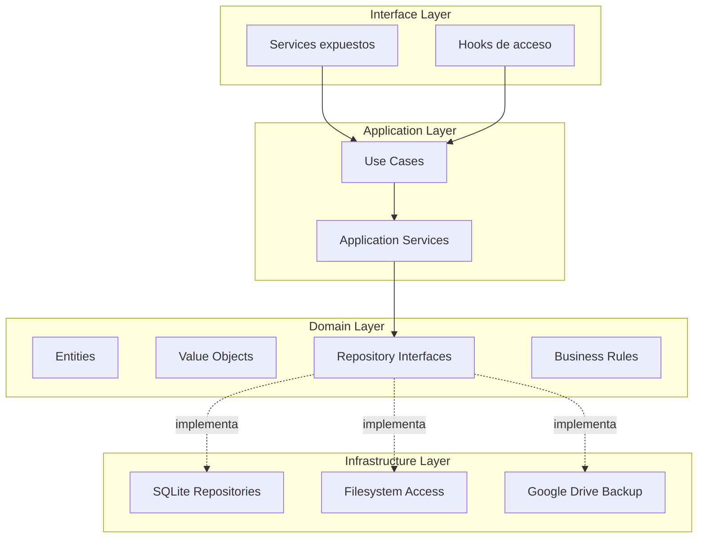
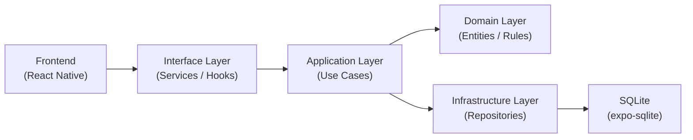
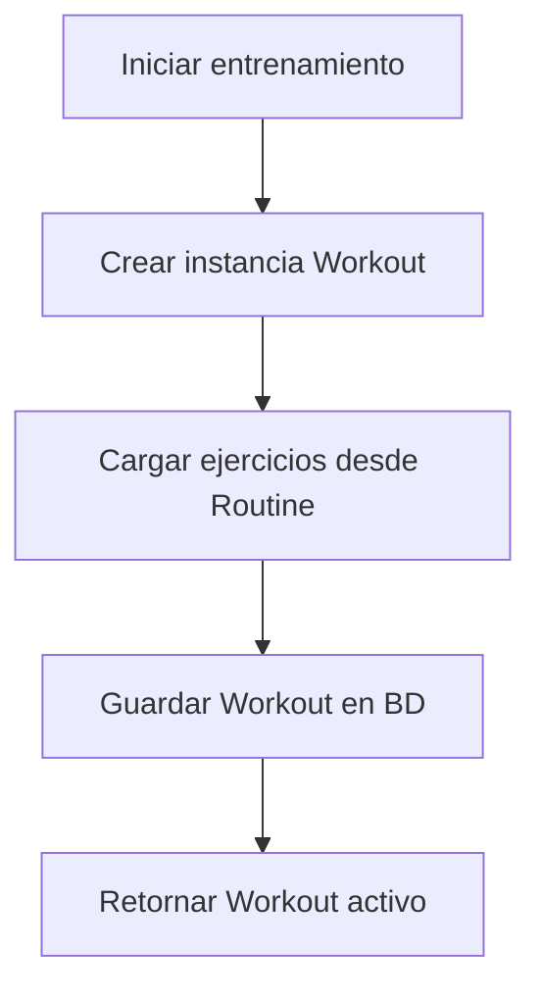
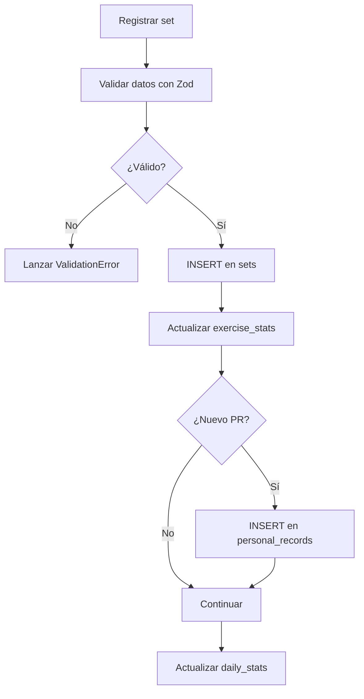
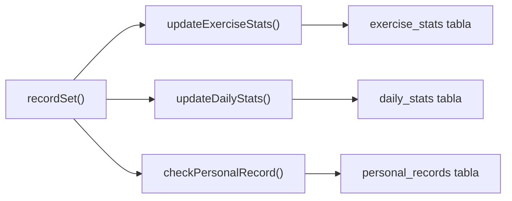
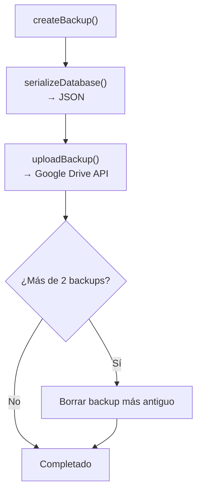

# Especificación Técnica – Backend

## Aplicación Personal de Entrenamiento (estilo Hevy)

---

## 1. Objetivo del Backend

El backend de la aplicación será una **capa lógica local embebida** encargada de:

- Manejar la lógica de negocio
- Interactuar con la base de datos SQLite
- Calcular estadísticas
- Generar recomendaciones de peso
- Administrar backups
- Exponer servicios al frontend

> [!IMPORTANT]
> A diferencia de una arquitectura cliente-servidor tradicional, este backend está **embebido dentro de la aplicación móvil**. No habrá servidor remoto. Toda la lógica corre en el dispositivo.

---

## 2. Filosofía de diseño

| Principio                              | Descripción                                             |
| -------------------------------------- | ------------------------------------------------------- |
| **Offline-first**                      | Funcionalidad completa sin conexión a internet          |
| **Alta cohesión**                      | Cada módulo tiene una responsabilidad bien definida     |
| **Bajo acoplamiento**                  | Las capas se comunican solo mediante interfaces         |
| **Separación lógica/UI**              | La lógica de negocio **nunca** vive en el frontend      |
| **Facilidad de testeo**               | Toda la lógica es testeable de forma aislada           |
| **Type-first development**            | Los tipos definen el contrato antes de la implementación |

---

## 3. Lenguaje y entorno

**TypeScript** — ejecutado dentro del entorno de React Native / Expo.

| Ventaja                             | Impacto                                  |
| ----------------------------------- | ---------------------------------------- |
| Tipado fuerte                       | Menos errores en tiempo de ejecución     |
| Mejor mantenibilidad                | Refactoring seguro con soporte del IDE   |
| Discriminated unions                | Estados ilegales irrepresentables        |
| Integración con frontend            | Mismo lenguaje en toda la aplicación     |

### Modo estricto obligatorio

```json
// tsconfig.json (parcial)
{
  "compilerOptions": {
    "strict": true,
    "noUncheckedIndexedAccess": true,
    "exactOptionalPropertyTypes": true
  }
}
```

---

## 4. Arquitectura

Se utiliza **Clean Architecture + Domain Driven Design (DDD ligero)**.

### Diagrama de capas



### Flujo de datos



> [!WARNING]
> El frontend **no debe** interactuar directamente con SQLite. Todo el acceso a datos pasa por las capas intermedias.

---

## 5. Capas del sistema

### 5.1 Domain Layer

La capa más interna. **No depende de ninguna otra capa.**

Contiene:

- **Entities**: objetos de negocio con identidad
- **Value Objects**: objetos inmutables sin identidad
- **Repository Interfaces**: contratos de acceso a datos
- **Business Rules**: validaciones y reglas de dominio

---

### 5.2 Application Layer

Orquesta los casos de uso del sistema.

Contiene:

- **Use Cases**: acciones concretas del usuario
- **Application Services**: lógica de coordinación entre repositorios

---

### 5.3 Infrastructure Layer

Implementaciones concretas de las interfaces del dominio.

Contiene:

- **SQLite Repositories**: acceso a la base de datos
- **Filesystem**: acceso al sistema de archivos
- **Google Drive Integration**: servicio de backups

---

### 5.4 Interface Layer

Puente entre el frontend y la lógica de negocio.

Contiene:

- **Services expuestos**: API del backend para el frontend
- **Hooks de acceso**: React hooks que consumen los services

---

## 6. Entidades del dominio

### `Exercise`

```typescript
interface Exercise {
  readonly id: string;
  name: string;
  primaryMuscle: MuscleGroup;
  secondaryMuscles: MuscleGroup[];
  equipment: Equipment;
  weightIncrement: number;
  animationPath: string | null;
  description: string | null;
}

// Discriminated union para grupos musculares
const MUSCLE_GROUPS = [
  'chest', 'back', 'shoulders', 'biceps', 'triceps',
  'forearms', 'quadriceps', 'hamstrings', 'glutes',
  'calves', 'abs', 'traps'
] as const;

type MuscleGroup = typeof MUSCLE_GROUPS[number];

const EQUIPMENT = [
  'barbell', 'dumbbell', 'machine', 'cable',
  'bodyweight', 'band', 'other'
] as const;

type Equipment = typeof EQUIPMENT[number];
```

---

### `Routine`

```typescript
interface Routine {
  readonly id: string;
  name: string;
  notes: string | null;
  exercises: RoutineExercise[];
  createdAt: Date;
}

interface RoutineExercise {
  readonly id: string;
  exerciseId: string;
  orderIndex: number;
  targetSets: number;
  targetReps: number;
  restSeconds: number;
  supersetGroup: number | null;
}
```

---

### `Workout`

```typescript
interface Workout {
  readonly id: string;
  routineId: string | null;
  date: Date;
  durationSeconds: number;
  notes: string | null;
  exercises: WorkoutExercise[];
}

interface WorkoutExercise {
  readonly id: string;
  exerciseId: string;
  orderIndex: number;
  skipped: boolean;
  notes: string | null;
  supersetGroup: number | null;
  sets: WorkoutSet[];
}
```

---

### `WorkoutSet`

```typescript
interface WorkoutSet {
  readonly id: string;
  exerciseId: string;
  setNumber: number;
  weight: number;
  reps: number;
  setType: 'normal' | 'warmup' | 'dropset' | 'failure';
  rir: number | null;
  restSeconds: number | null;
  durationSeconds: number;  // para ejercicios por tiempo
  completed: boolean;
  skipped: boolean;
  createdAt: Date;
}

---

### `UserPreferences`

```typescript
interface UserPreferences {
  theme: 'light' | 'dark' | 'system';
  weightUnit: 'kg' | 'lbs';
  defaultRestSeconds: number;
}
```

---

### `BodyWeightEntry`

```typescript
interface BodyWeightEntry {
  readonly id: string;
  weight: number;
  date: Date;
  notes: string | null;
  createdAt: Date;
}
```

---

## 7. Validación con Zod

Los esquemas de Zod son **la fuente de verdad** para validación en tiempo de ejecución.

```typescript
import { z } from 'zod';

// --- Schemas ---

export const WorkoutSetSchema = z.object({
  exerciseId: z.string().uuid(),
  setNumber: z.number().int().positive(),
  weight: z.number().min(0, 'El peso no puede ser negativo'),
  reps: z.number().int().min(0, 'Las reps no pueden ser negativas'),
  rir: z.number().int().min(0).max(10).nullable().default(null),
  durationSeconds: z.number().int().min(0).default(0),
  completed: z.boolean().default(false),
  skipped: z.boolean().default(false),
});

export type CreateSetInput = z.infer<typeof WorkoutSetSchema>;

export const WorkoutSchema = z.object({
  routineId: z.string().uuid().nullable(),
  notes: z.string().max(500).nullable().default(null),
});

export type CreateWorkoutInput = z.infer<typeof WorkoutSchema>;

// --- Validación segura ---

export function validateSetInput(raw: unknown) {
  const result = WorkoutSetSchema.safeParse(raw);
  if (!result.success) {
    throw new ValidationError(
      'Set inválido',
      result.error.flatten().fieldErrors
    );
  }
  return result.data;
}
```

---

## 8. Repository Interfaces

Los repositorios abstraen el acceso a la base de datos. Se definen como **interfaces en el dominio** y se implementan en infraestructura.

```typescript
// domain/repositories/ExerciseRepository.ts
interface ExerciseRepository {
  getAll(): Promise<Exercise[]>;
  getById(id: string): Promise<Exercise | null>;
  search(query: string): Promise<Exercise[]>;
  save(exercise: Exercise): Promise<void>;
}

// domain/repositories/WorkoutRepository.ts
interface WorkoutRepository {
  getById(id: string): Promise<Workout | null>;
  getByDateRange(start: Date, end: Date): Promise<Workout[]>;
  save(workout: Workout): Promise<void>;
  delete(id: string): Promise<void>;
}

// domain/repositories/RoutineRepository.ts
interface RoutineRepository {
  getAll(): Promise<Routine[]>;
  getById(id: string): Promise<Routine | null>;
  save(routine: Routine): Promise<void>;
  delete(id: string): Promise<void>;
}

// domain/repositories/StatsRepository.ts
interface StatsRepository {
  getExerciseStats(exerciseId: string): Promise<ExerciseStats | null>;
  updateExerciseStats(stats: ExerciseStats): Promise<void>;
  getDailyStats(date: Date): Promise<DailyStats | null>;
  upsertDailyStats(stats: DailyStats): Promise<void>;
  getPersonalRecords(exerciseId: string): Promise<PersonalRecord[]>;
  savePersonalRecord(record: PersonalRecord): Promise<void>;
}
```

### Implementación en infraestructura

```typescript
// infrastructure/repositories/SQLiteExerciseRepository.ts
class SQLiteExerciseRepository implements ExerciseRepository {
  constructor(private db: SQLiteDatabase) {}

  async getAll(): Promise<Exercise[]> {
    return this.db.getAllAsync<Exercise>('SELECT * FROM exercises');
  }

  async getById(id: string): Promise<Exercise | null> {
    return this.db.getFirstAsync<Exercise>(
      'SELECT * FROM exercises WHERE id = ?',
      [id]
    );
  }

  async search(query: string): Promise<Exercise[]> {
    return this.db.getAllAsync<Exercise>(
      'SELECT * FROM exercises WHERE name LIKE ?',
      [`%${query}%`]
    );
  }

  async save(exercise: Exercise): Promise<void> {
    await this.db.runAsync(
      `INSERT OR REPLACE INTO exercises (id, name, primary_muscle, secondary_muscles, equipment, weight_increment, animation_path, description)
       VALUES (?, ?, ?, ?, ?, ?, ?, ?)`,
      [exercise.id, exercise.name, exercise.primaryMuscle, JSON.stringify(exercise.secondaryMuscles), exercise.equipment, exercise.weightIncrement, exercise.animationPath, exercise.description]
    );
  }
}
```

---

## 9. Casos de uso principales

Cada caso de uso encapsula **una acción concreta** del sistema.

### `StartWorkout`



```typescript
class StartWorkoutUseCase {
  constructor(
    private workoutRepo: WorkoutRepository,
    private routineRepo: RoutineRepository,
  ) {}

  async execute(routineId: string): Promise<Workout> {
    const routine = await this.routineRepo.getById(routineId);
    if (!routine) {
      throw new DomainError(`Routine ${routineId} no encontrada`);
    }

    const workout: Workout = {
      id: generateId(),
      routineId,
      date: new Date(),
      durationSeconds: 0,
      notes: null,
      exercises: routine.exercises.map((re) => ({
        id: generateId(),
        exerciseId: re.exerciseId,
        orderIndex: re.orderIndex,
        skipped: false,
        sets: [],
      })),
    };

    await this.workoutRepo.save(workout);
    return workout;
  }
}
```

---

### `RecordSet`



```typescript
class RecordSetUseCase {
  constructor(
    private workoutRepo: WorkoutRepository,
    private statsRepo: StatsRepository,
  ) {}

  async execute(workoutId: string, input: unknown): Promise<WorkoutSet> {
    // Validar con Zod
    const data = validateSetInput(input);

    // Crear set
    const set: WorkoutSet = {
      id: generateId(),
      ...data,
      createdAt: new Date(),
    };

    // Transacción atómica
    await this.workoutRepo.addSet(workoutId, set);
    await this.statsRepo.updateExerciseStats(/* ... */);
    await this.statsRepo.upsertDailyStats(/* ... */);

    // Verificar PR
    const isPR = await this.checkPersonalRecord(set);
    if (isPR) {
      await this.statsRepo.savePersonalRecord(/* ... */);
    }

    return set;
  }
}
```

---

### `FinishWorkout`

```typescript
class FinishWorkoutUseCase {
  constructor(private workoutRepo: WorkoutRepository) {}

  async execute(workoutId: string): Promise<Workout> {
    const workout = await this.workoutRepo.getById(workoutId);
    if (!workout) {
      throw new DomainError(`Workout ${workoutId} no encontrado`);
    }

    // Calcular duración
    const duration = Math.floor(
      (Date.now() - workout.date.getTime()) / 1000
    );

    const finishedWorkout = { ...workout, durationSeconds: duration };
    await this.workoutRepo.save(finishedWorkout);

    return finishedWorkout;
  }
}
```

---

### `SkipExercise`

```typescript
class SkipExerciseUseCase {
  constructor(private workoutRepo: WorkoutRepository) {}

  async execute(workoutId: string, exerciseId: string): Promise<void> {
    await this.workoutRepo.markExerciseSkipped(workoutId, exerciseId);
  }
}
```

---

## 10. Servicios del sistema

Los services son la **interfaz pública** que el frontend consume.

```typescript
// interface/services/WorkoutService.ts
class WorkoutService {
  constructor(
    private startWorkout: StartWorkoutUseCase,
    private recordSet: RecordSetUseCase,
    private finishWorkout: FinishWorkoutUseCase,
    private skipExercise: SkipExerciseUseCase,
  ) {}

  async start(routineId: string): Promise<Workout> {
    return this.startWorkout.execute(routineId);
  }

  async addSet(workoutId: string, input: unknown): Promise<WorkoutSet> {
    return this.recordSet.execute(workoutId, input);
  }

  async finish(workoutId: string): Promise<Workout> {
    return this.finishWorkout.execute(workoutId);
  }

  async skip(workoutId: string, exerciseId: string): Promise<void> {
    return this.skipExercise.execute(workoutId, exerciseId);
  }
}

// interface/services/ExerciseService.ts
class ExerciseService {
  constructor(private exerciseRepo: ExerciseRepository) {}

  async getAll(): Promise<Exercise[]> {
    return this.exerciseRepo.getAll();
  }

  async getById(id: string): Promise<Exercise | null> {
    return this.exerciseRepo.getById(id);
  }

  async search(query: string): Promise<Exercise[]> {
    return this.exerciseRepo.search(query);
  }
}

// interface/services/StatsService.ts
class StatsService {
  constructor(private statsRepo: StatsRepository) {}

  async getExerciseStats(exerciseId: string): Promise<ExerciseStats | null> {
    return this.statsRepo.getExerciseStats(exerciseId);
  }

  async getDailyStats(date: Date): Promise<DailyStats | null> {
    return this.statsRepo.getDailyStats(date);
  }

  async getPersonalRecords(exerciseId: string): Promise<PersonalRecord[]> {
    return this.statsRepo.getPersonalRecords(exerciseId);
  }
}

// interface/services/BackupService.ts
class BackupService {
  constructor(
    private createBackupUseCase: CreateBackupUseCase,
    private restoreBackupUseCase: RestoreBackupUseCase,
    private exportCSVUseCase: ExportCSVUseCase
  ) {}

  async createBackup(): Promise<string> { /* ... */ }
  async restoreBackup(data: string): Promise<void> { /* ... */ }
  async exportCSV(): Promise<string> { /* ... */ }
}

// interface/services/PreferencesService.ts
class PreferencesService {
  // Methods to get/update UserPreferences
}

// interface/services/BodyWeightService.ts
class BodyWeightService {
  // Methods to log and retrieve body weight history
}
```

---

## 11. Manejo de errores

Errores estructurados con jerarquía de clases:

```typescript
// shared/errors.ts

abstract class AppError extends Error {
  abstract readonly code: string;
  abstract readonly statusCode: number;

  constructor(message: string, public readonly details?: unknown) {
    super(message);
    this.name = this.constructor.name;
  }
}

class DomainError extends AppError {
  readonly code = 'DOMAIN_ERROR';
  readonly statusCode = 400;
}

class ValidationError extends AppError {
  readonly code = 'VALIDATION_ERROR';
  readonly statusCode = 422;

  constructor(message: string, public readonly fieldErrors: Record<string, string[]>) {
    super(message, fieldErrors);
  }
}

class NotFoundError extends AppError {
  readonly code = 'NOT_FOUND';
  readonly statusCode = 404;
}

class DatabaseError extends AppError {
  readonly code = 'DATABASE_ERROR';
  readonly statusCode = 500;
}
```

> [!TIP]
> **Exhaustive error handling**: Cada capa propaga errores con contexto. Nunca se traguen errores silenciosamente.

---

## 12. Estrategia de transacciones

Las operaciones críticas **deben ejecutarse en transacciones** para asegurar consistencia.

```typescript
async function recordSetTransaction(
  db: SQLiteDatabase,
  workoutId: string,
  set: WorkoutSet,
): Promise<void> {
  await db.withTransactionAsync(async () => {
    // 1. Insertar set
    await db.runAsync(
      'INSERT INTO sets (...) VALUES (...)',
      [/* params */]
    );

    // 2. Actualizar estadísticas del ejercicio
    await db.runAsync(
      'UPDATE exercise_stats SET ... WHERE exercise_id = ?',
      [set.exerciseId]
    );

    // 3. Verificar y guardar PR
    const currentMax = await db.getFirstAsync(
      'SELECT max_weight FROM exercise_stats WHERE exercise_id = ?',
      [set.exerciseId]
    );

    if (set.weight > (currentMax?.max_weight ?? 0)) {
      await db.runAsync(
        'INSERT INTO personal_records (...) VALUES (...)',
        [/* params */]
      );
    }

    // 4. Actualizar estadísticas diarias
    await db.runAsync(
      `INSERT INTO daily_stats (date, ...) VALUES (?, ...)
       ON CONFLICT(date) DO UPDATE SET ...`,
      [/* params */]
    );
  });
}
```

> [!CAUTION]
> Si algún paso dentro de la transacción falla, **todo el bloque se revierte automáticamente**. Nunca hacer operaciones multi-tabla sin transacción.

---

## 13. Arquitectura de carpetas

```
src/
├── domain/
│   ├── entities/
│   │   ├── Exercise.ts
│   │   ├── Workout.ts
│   │   ├── WorkoutSet.ts
│   │   └── Routine.ts
│   ├── repositories/
│   │   ├── ExerciseRepository.ts
│   │   ├── WorkoutRepository.ts
│   │   ├── RoutineRepository.ts
│   │   └── StatsRepository.ts
│   └── valueObjects/
│       ├── MuscleGroup.ts
│       └── Equipment.ts
│
├── application/
│   ├── useCases/
│   │   ├── StartWorkout.ts
│   │   ├── RecordSet.ts
│   │   ├── FinishWorkout.ts
│   │   ├── SkipExercise.ts
│   │   └── SuggestWeightUseCase.ts
│   └── services/
│       └── StatsCalculator.ts
│
├── infrastructure/
│   ├── database/
│   │   ├── connection.ts
│   │   ├── migrations/
│   │   │   ├── 001_initial_schema.ts
│   │   │   └── 002_add_indexes.ts
│   │   └── seeds/
│   │       └── exercises.ts
│   ├── repositories/
│   │   ├── SQLiteExerciseRepository.ts
│   │   ├── SQLiteWorkoutRepository.ts
│   │   ├── SQLiteRoutineRepository.ts
│   │   └── SQLiteStatsRepository.ts
│   ├── di/
│   │   └── container.ts
│   ├── scripts/
│   │   └── wgerMapper.ts
│   └── backup/
│       └── DriveBackupService.ts
│
├── interface/
│   ├── services/
│   │   ├── WorkoutService.ts
│   │   ├── ExerciseService.ts
│   │   ├── StatsService.ts
│   │   └── BackupService.ts
│   └── hooks/
│       ├── useWorkout.ts
│       ├── useExercises.ts
│       └── useStats.ts
│
└── shared/
    ├── errors.ts
    ├── types.ts
    ├── utils/
    │   ├── generateId.ts
    │   └── dateUtils.ts
    └── schemas/
        ├── workoutSchemas.ts
        └── exerciseSchemas.ts
```

---

## 14. Dependencias

| Paquete      | Uso                              | Justificación                         |
| ------------ | -------------------------------- | ------------------------------------- |
| `expo-sqlite`| Acceso a SQLite                  | Integración nativa con Expo           |
| `zod`        | Validación de datos              | Source of truth + type inference       |
| `date-fns`   | Manipulación de fechas           | Inmutable, tree-shakeable, ligero     |
| `expo-crypto`| Generación de UUIDs              | Mucho más rápido que UUID nativo de JS |

---

## 15. Estrategia de testing

### Herramientas

| Herramienta  | Tipo de test                      |
| ------------ | --------------------------------- |
| `jest`       | Unit tests + integration tests    |
| `ts-jest`    | Soporte TypeScript para Jest      |

### Cobertura objetivo

```
Target mínimo: 80%
├── Use Cases  → 90%+
├── Services   → 85%+
├── Validators → 95%+
└── Repositories → 70%+ (integración)
```

### Ejemplo de test (patrón AAA)

```typescript
// application/useCases/__tests__/RecordSet.test.ts
describe('RecordSetUseCase', () => {
  let useCase: RecordSetUseCase;
  let mockWorkoutRepo: jest.Mocked<WorkoutRepository>;
  let mockStatsRepo: jest.Mocked<StatsRepository>;

  beforeEach(() => {
    mockWorkoutRepo = {
      addSet: jest.fn(),
      getById: jest.fn(),
    } as any;
    mockStatsRepo = {
      updateExerciseStats: jest.fn(),
      upsertDailyStats: jest.fn(),
      savePersonalRecord: jest.fn(),
    } as any;

    useCase = new RecordSetUseCase(mockWorkoutRepo, mockStatsRepo);
  });

  it('should save a valid set and update stats', async () => {
    // Arrange
    const input = {
      exerciseId: 'uuid-123',
      setNumber: 1,
      weight: 100,
      reps: 8,
      durationSeconds: 0,
      completed: true,
      skipped: false,
    };

    // Act
    const result = await useCase.execute('workout-id', input);

    // Assert
    expect(mockWorkoutRepo.addSet).toHaveBeenCalledOnce();
    expect(mockStatsRepo.updateExerciseStats).toHaveBeenCalledOnce();
    expect(result.weight).toBe(100);
    expect(result.reps).toBe(8);
  });

  it('should throw ValidationError for negative weight', async () => {
    // Arrange
    const input = { exerciseId: 'uuid-123', weight: -5, reps: 8 };

    // Act & Assert
    await expect(useCase.execute('workout-id', input))
      .rejects
      .toThrow(ValidationError);
  });
});
```

---

## 16. Gestión de estadísticas

Las estadísticas se calculan **en escritura, no en lectura**.



Esto mantiene las consultas de lectura **instantáneas**.

---

## 17. Backups



### Política de retención

- **1 backup actual** + **1 backup anterior**
- Formato: JSON exportado de todas las tablas

---

## 18. Logging

```typescript
// shared/utils/Logger.ts

const LOG_LEVELS = ['debug', 'info', 'warn', 'error'] as const;
type LogLevel = typeof LOG_LEVELS[number];

class Logger {
  constructor(private namespace: string) {}

  debug(message: string, ...args: unknown[]): void {
    if (__DEV__) {
      console.debug(`[${this.namespace}]`, message, ...args);
    }
  }

  info(message: string, ...args: unknown[]): void {
    console.info(`[${this.namespace}]`, message, ...args);
  }

  warn(message: string, ...args: unknown[]): void {
    console.warn(`[${this.namespace}]`, message, ...args);
  }

  error(message: string, error?: Error): void {
    console.error(`[${this.namespace}]`, message, error);
  }
}

// Uso:
const log = new Logger('WorkoutService');
log.info('Workout iniciado', { routineId: '...' });
```
