# Especificación Técnica – Frontend

## Aplicación Personal de Entrenamiento (estilo Hevy)

---

## 1. Objetivo del Frontend

El frontend es responsable de:

- Renderizar la interfaz de usuario
- Gestionar interacciones y navegación
- Controlar animaciones, temporizadores y feedback háptico
- Manejar estado visual y transiciones entre pantallas
- Conectarse con el backend local vía Services/Hooks

> [!IMPORTANT]
> El frontend **no debe contener lógica de negocio**. Toda lógica reside en el backend local (ver `Back.md`). El frontend solo consume Services.

### Principios de diseño

| Principio             | Implementación                                   |
| --------------------- | ------------------------------------------------ |
| **Rápido**            | FlashList, memoización, lazy loading             |
| **Reactivo**          | Zustand + re-renders mínimos                     |
| **Accesible**         | Touch targets ≥44pt, contraste ≥4.5:1, VoiceOver |
| **Offline-first**     | Todo funciona sin conexión                       |
| **Fácil de mantener** | MVVM + componentes reutilizables                 |

---

## 2. Stack tecnológico

| Tecnología                          | Uso                                                                                                             |
| ----------------------------------- | --------------------------------------------------------------------------------------------------------------- |
| **React Native + Expo**             | Framework principal                                                                                             |
| **TypeScript**                      | Lenguaje (modo `strict`)                                                                                        |
| **Expo Router**                     | Navegación file-based                                                                                           |
| **Zustand**                         | Estado global                                                                                                   |
| **Tamagui v1**                      | Sistema de UI. Design tokens en `tamagui.config.ts`. Paleta Temper v2: Carbón + Cobre + Brasa. Cero hex en JSX. |
| **@gorhom/bottom-sheet**            | Bottom sheets nativos a 60fps (Buscador de ejercicios, opciones, nota de sesión)                                |
| **React Native Reanimated**         | Animaciones UI thread (microinteracciones, barras de progreso, celebraciones)                                   |
| **React Native Gesture Handler**    | Gestos swipe (delete reveal en SetRow via Swipeable)                                                            |
| **react-native-draggable-flatlist** | Drag & Drop en listas de ejercicios de rutinas                                                                  |
| **FlashList / FlatList**            | Listas de alto rendimiento (history, exercise browser)                                                          |
| **Lucide React Native**             | Sistema de iconos SVG —única fuente de íonos                                                                    |
| **expo-haptics**                    | Feedback háptico en momentos clave                                                                              |
| **react-native-toast-message**      | Notificaciones toast (guardado, error)                                                                          |
| **date-fns**                        | Formateo y cálculo de fechas                                                                                    |

> [!NOTE]
> **Preferencias de librería** según skill `building-native-ui`:
>
> - `expo-image` en lugar de `<Image>` nativo
> - `Pressable` en lugar de `TouchableOpacity` (cuando no hay comportamientos avanzados)
> - `TextInput` de React Native para inputs (mejor control nativo y performance)
> - `process.env.EXPO_OS` en lugar de `Platform.OS`
> - Inline styles en lugar de `StyleSheet.create` (salvo estilos reutilizados)
> - **Dependencias en hooks**: Siempre incluir las funciones/servicios en el array de dependencias de `useEffect` para evitar stale closures

---

## 2.1 Desglose y Propósito de cada Librería

Para evitar redundancias y mantener un desarrollo limpio, aquí se detalla el uso exclusivo de cada librería a lo largo de la app:

### Sistema Base y Estructura

- **`expo` / `react-native`**: Motor base y acceso a APIs del sistema operativo (teclado, portapapeles, dimensiones).
- **`expo-router`**: Gestiona **toda la navegación**, incluyendo las Tabs del menú inferior y el Stack (pila) de pantallas superpuestas (ej: ir de Home a Workout Screen). Todo vive bajo la carpeta `app/`.
- **`zustand`**: Gestión del **estado global sincrónico prestablecido** como el temporizador de descanso, el entrenamiento activo (`workoutStore`), o los filtros seleccionados (`exerciseStore`). _No usar para estados locales UI (ej. abrir/cerrar un popup)._

### UI y Estilos (Look and Feel)

- **`tamagui` & `@tamagui/core`**: Sistema de diseño principal. Construcción de componentes atómicos (Buttons, Cards, Stack layouts). Utiliza tokens de diseño definidos (colores, espaciado `8dp`) para compilar estilos nativos eficientes en lugar del viejo `StyleSheet.create`.
- **`react-native` TextInput**: Inputs de texto/búsqueda usan `TextInput` nativo de React Native (no Tamagui) para mejor control, performance y compatibilidad con teclados nativos. _Uso en: búsquedas, campos de formulario, notas._
- **`lucide-react-native`**: **Única fuente de íconos**. Utilizada en botones, menús y Tabs. _Prohibido usar emojis estructurales o mezclar librerías de íconos._
- **`expo-font`**: Utilizada para cargar fuentes modernas (Inter, Roboto) y crucial para aplicar la regla `fontVariant: ['tabular-nums']` en textos numéricos fluctuantes (pesos, cronómetros).

### Listas de Rendimiento Crítico

- **`@shopify/flash-list`**: Obligatorio para **todas las listas largas o dinámicas** por su superioridad técnica (reemplaza a FlatList).
  - _Uso obligatorio en:_ Pantalla de _Routines_, _History_, buscador del _Exercise Browser_, y la lista de Sets (`SetRow`) en la _Workout Screen_.

### Interfaz Avanzada y Navegación Overlay

- **`@gorhom/bottom-sheet`**: Exclusivo para modales que emergen desde la base a 60fps.
  - _Casos:_ **Exercise Browser** (el modal para buscar/agregar ejercicios), selectores rápidos u opciones contextuales (long-press en History).
- **`react-native-safe-area-context`**: Fundamental para evitar que los elementos de UI queden bloqueados por el "Notch/Isla Dinámica" en iOS o las barras de navegación en Android.

### Interacción y Sensaciones Físicas (Feedback)

- **`expo-haptics`**: Feedback físico al usuario en momentos clave (vibración).
  - _Casos:_ `Medium` al completar un Set (check ✔). `Notification` al finalizar el temporizador. `Heavy` al romper un récord personal (PR).
- **`react-native-toast-message`**: Feedback visual rápido y no bloqueante (Ej: "Rutina guardada con éxito" o alertas de error de formulario).

### Animaciones

- **`react-native-reanimated`**: Animaciones fluidas atadas al hilo de la UI. Microinteracciones.
  - _Casos:_ El efecto de presionado del check en `SetRow`, transiciones de Drag & Drop, o el desplazamiento de sliders/barras de progreso.
- **`lottie-react-native`**: Animaciones vectoriales pre-renderizadas no atadas al estado interactivo.
  - _Casos:_ Celebraciones grandes de PRs, onboarding, o `EmptyChartState` súper visuales.

### Ejercicios y Visualización de Datos

- **`expo-image`**: Utilizada para cargar los assets de imágenes y, lo más importante, las **animaciones WebP de los ejercicios** (ej. mostrar un press banca en loop dentro del _Exercise Detail_ y el _Workout Screen_) gracias a su carga bajo demanda (lazy load).
- **`victory-native`**: Exclusivo para el tab de **Stats**. Renderiza los gráficos de progreso (torta de balance muscular, barras del volumen levantado, o línea de estimación 1RM).

### Utilidades y Lógica Liviana

- **`date-fns`**: Parseo y formato de fechas limpios para toda la app (Ej: Formatear tiempos "Ayer a las 18:00", duraciones, etc.).
- **`zod`**: Validación robusta de formularios antes de hablar con los Services/Stores (Ej: Validar que el peso insertado es > 0, o que el nombre de rutina existe).
- **`expo-crypto`**: Empleado para **generar UUIDs ultrarrápidos** localmente, vital a la hora de asignar IDs temporales a nuevos sets o rutinas generados en pantalla antes de mandarlos a la base de datos backend.

---

## 3. Arquitectura frontend — MVVM

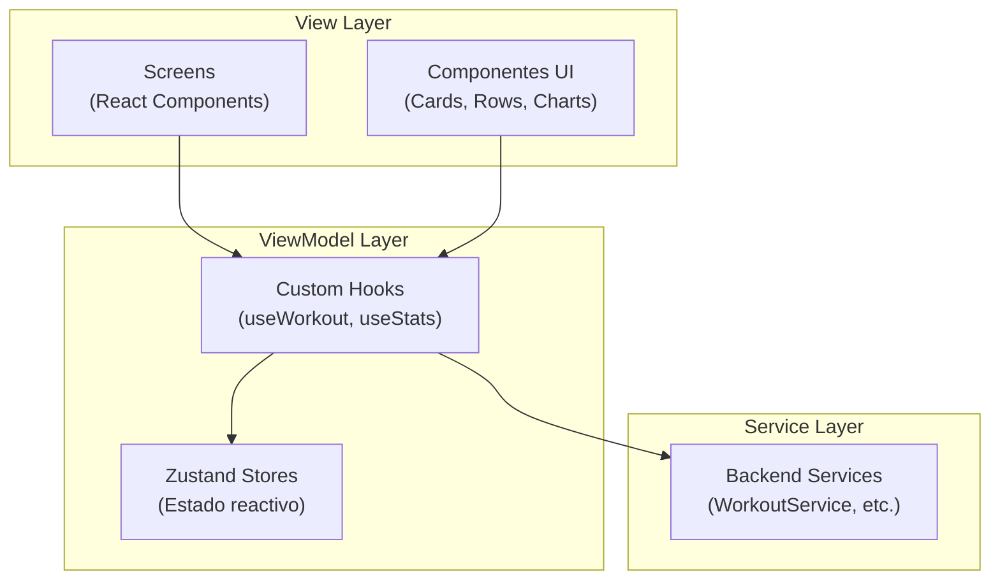

| Capa          | Responsabilidad                             | No debe hacer          |
| ------------- | ------------------------------------------- | ---------------------- |
| **View**      | Renderizar UI, capturar input del usuario   | Lógica de negocio, SQL |
| **ViewModel** | Gestionar estado, transformar datos para UI | Acceso directo a BD    |
| **Service**   | Puente al backend local                     | Renderizar componentes |

### Descomposición relevante del flujo de workout activo

- `app/(workouts)/[active].tsx`: Orquesta estado, navegación, animaciones globales y coordinación entre stores/hooks.
- `components/workout/ActiveWorkoutExerciseDetail.tsx`: Renderiza el detalle del ejercicio actual y la tabla de sets.
- `components/workout/ActiveWorkoutRestTimerChip.tsx`: Encapsula el chip del descanso con su barra de progreso.
- `components/workout/ActiveWorkoutBottomBar.tsx`: Agrupa acciones persistentes de navegación, nota y acceso al timer.
- `components/workout/ActiveWorkoutExercisePickerSheet.tsx`, `ActiveWorkoutOptionsSheet.tsx`, `WorkoutSessionNoteSheet.tsx`: Separan los tres bottom sheets del screen principal para mantener responsabilidades acotadas.

---

## 4. Estructura de navegación

### Tabs principales

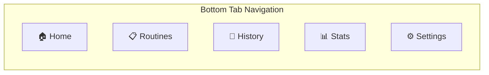

### Mapa de navegación completo

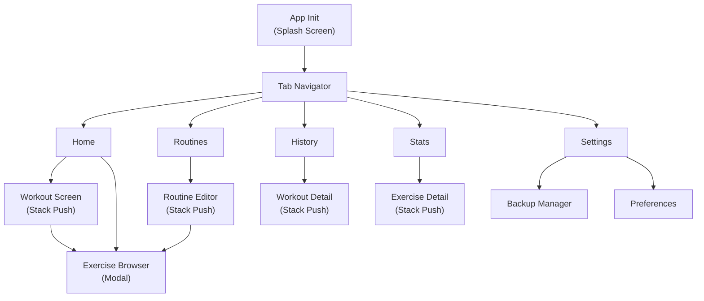

### Implementación con Expo Router

```text
app/
├── _layout.tsx                    ← Root Layout (Configura Providers, Colors, BottomSheetModal)
├── modal.tsx                      ← Modal global
├── (tabs)/
│   ├── _layout.tsx                ← NativeTabs / Bottom Tabs navigation
│   ├── index.tsx                  ← 🏠 Home
│   ├── routines.tsx               ← 📋 Routines tab
│   ├── history.tsx                ← 📜 History tab
│   ├── stats.tsx                  ← 📊 Stats tab
│   └── settings.tsx               ← ⚙️ Settings tab
├── (workouts)/
│   ├── _layout.tsx                ← Stack para flujos de workout
│   ├── [active].tsx               ← Workout activo
│   ├── exercise-browser.tsx       ← Buscador de ejercicios (Modal)
│   ├── rest-timer.tsx             ← Timer modal
│   └── summary.tsx                ← Resumen post-workout
├── exercise/
│   └── [id].tsx                   ← Detalle de ejercicio
├── history/
│   └── [id].tsx                   ← Detalle de workout en historial
├── routine/
│   ├── create.tsx                 ← Creador de rutina
│   └── [id].tsx                   ← Editor/Detalle de rutina
├── settings/
│   ├── notifications.tsx          ← Configuración notificaciones
│   ├── privacy.tsx                ← Privacidad
│   └── profile.tsx                ← Perfil de usuario
└── stats/
    └── weight.tsx                 ← Registro de peso corporal
```

> [!TIP]
> La navegación principal está aislada en `(tabs)` y `(workouts)`. Las pantallas de detalle (ejercicio, historial de sesión individual, rutinas) son rutas anidadas modulares.

---

## 5. Pantallas del sistema — Descripción exhaustiva

### 5.1 🏠 Home (Tab Principal)

**Función**: Dashboard principal — acceso rápido a entrenar y resumen del estado actual.

**Layout**: ScrollView vertical con `contentInsetAdjustmentBehavior="automatic"`.

#### Componentes de la pantalla

| #   | Componente                      | Descripción detallada                                                                                                                                                                 | Datos                                 |
| --- | ------------------------------- | ------------------------------------------------------------------------------------------------------------------------------------------------------------------------------------- | ------------------------------------- |
| 1   | **Header nativo**               | Título "GymApp" con large title. Sin botones adicionales.                                                                                                                             | Stack header                          |
| 2   | **CTA "Empezar Entrenamiento"** | Botón principal prominente, ancho completo (`width: 100%`), altura ≥56pt, gradiente `primary → primary-dark`, ícono `Play` (Lucide). Efecto pressed: `scale(0.97)` + haptic `Medium`. | —                                     |
| 3   | **Resumen rápido semanal**      | Card compacto con 3 métricas inline: 🏋️ Entrenamientos esta semana, ⏱ Tiempo total, 📊 Volumen total. Usa `fontVariant: 'tabular-nums'`.                                              | `StatsService.getWeeklyStats()`       |
| 4   | **Último entrenamiento**        | `WorkoutCard` con: fecha relativa ("Ayer", "Hace 2 días"), nombre rutina, duración, nº ejercicios, volumen. Tap → **Workout Detail**.                                                 | `WorkoutService` (último)             |
| 5   | **Rutinas recientes**           | ScrollView horizontal con `RoutineCard` (máx 5). Cada card: nombre, nº ejercicios, badge "Última vez: hace X días". Tap → inicia workout con esa rutina.                              | `RoutineService.getAll()`             |
| 6   | **Streak / Racha**              | Indicador visual de días consecutivos entrenando. Ícono `Flame` (Lucide) con contador. Se oculta si streak = 0.                                                                       | `StatsService.getTrainingFrequency()` |

#### Empty States

| Estado             | Contenido                                                               |
| ------------------ | ----------------------------------------------------------------------- |
| Sin entrenamientos | Ilustración Lottie + "¡Comienza tu primer entrenamiento!" + botón CTA   |
| Sin rutinas        | "Crea tu primera rutina para entrenar más rápido" + link a tab Routines |

#### Flujos de navegación desde Home

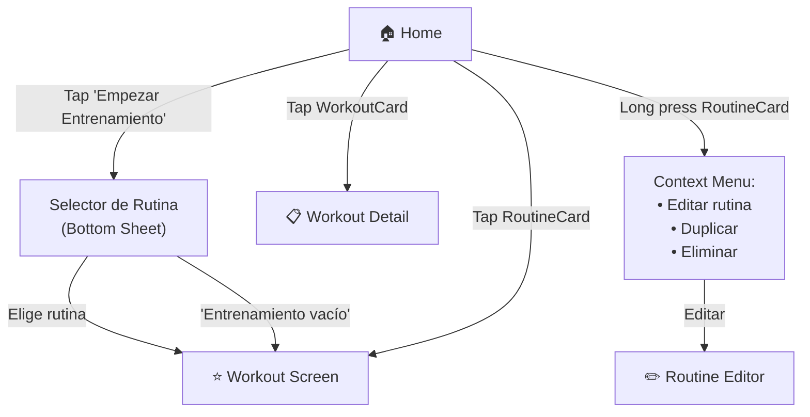

---

### 5.2 📋 Routines (Tab)

**Función**: CRUD completo de rutinas (plantillas de entrenamiento).

**Layout**: FlashList vertical de `RoutineCard`.

#### Componentes de la pantalla Routines

| #   | Componente                  | Descripción detallada                                                                                                         |
| --- | --------------------------- | ----------------------------------------------------------------------------------------------------------------------------- |
| 1   | **Header nativo**           | Título "Rutinas" (large title). Botón derecho: ícono `Plus` (Lucide) → **Routine Editor (crear)**                             |
| 2   | **Search bar**              | `headerSearchBarOptions` nativo en el Stack. Filtra rutinas por nombre en tiempo real con debounce 300ms.                     |
| 3   | **Lista de rutinas**        | FlashList con `RoutineCard`. Cada card muestra: nombre, nº ejercicios, músculos objetivo (badges), fecha de última vez usada. |
| 4   | **Swipe actions**           | Swipe izquierda sobre cada card: **Editar** (azul) y **Eliminar** (rojo, con confirmación).                                   |
| 5   | **Long press context menu** | Opciones: Entrenar, Editar, Duplicar, Eliminar. Usa `<Link.Menu>` de Expo Router.                                             |
| 6   | **FAB (alternativo)**       | En la esquina inferior derecha, `Plus` flotante. Solo visible si hay ≥ 1 rutina (si no, empty state tiene CTA).               |

#### Detalle de `RoutineCard`

```text
┌──────────────────────────────────────────┐
│  🏋️  Push Day                           │
│  5 ejercicios · Pecho, Tríceps, Hombros  │
│  Última vez: hace 3 días                 │
│                                    [▶]   │
└──────────────────────────────────────────┘
```

- **Tap card** → abre **Routine Detail / Editor** (modo vista).
- **Tap ▶** → inicia workout con esa rutina directamente.
- **Long press** → context menu.

#### Empty State

Ilustración Lottie (persona pensando) + "Aún no tenés rutinas" + botón "Crear mi primera rutina".

#### Flujos desde Routines

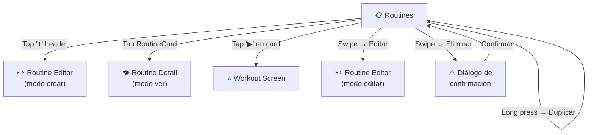

---

### 5.3 ✏️ Routine Editor (Stack Push)

**Función**: Crear o editar una rutina con sus ejercicios, sets objetivo y configuración.

**Layout**: ScrollView con KeyboardAwareScrollView para inputs.

#### Componentes de la pantalla Routine Editor

| #   | Componente                      | Descripción                                                                                                                                           |
| --- | ------------------------------- | ----------------------------------------------------------------------------------------------------------------------------------------------------- |
| 1   | **Header**                      | Título "Nueva Rutina" / "Editar Rutina". Botón izq: `X` (cancelar con confirmación si hay cambios). Botón der: "Guardar" (disabled si form inválido). |
| 2   | **Input nombre**                | TextInput con label visible "Nombre de la rutina". Validación: requerido, min 2 chars. Error debajo del campo.                                        |
| 3   | **Input notas**                 | TextInput multiline, label "Notas (opcional)". Placeholder: "Descripción, objetivo, etc."                                                             |
| 4   | **Lista de ejercicios**         | Drag & drop (Reanimated + GestureHandler). Cada item es un `RoutineExerciseRow`.                                                                      |
| 5   | **Botón "+ Agregar Ejercicio"** | Outlined button al final de la lista. Tap → abre **Exercise Browser** (modal/bottom sheet).                                                           |
| 6   | **Sección por ejercicio**       | Ver `RoutineExerciseRow` abajo.                                                                                                                       |

#### Detalle de `RoutineExerciseRow`

```text
┌────────────────────────────────────────────┐
│  ≡  Bench Press (compound)           [🗑]  │
│     Pecho, Tríceps                          │
│                                             │
│     Series objetivo:  [3]  ▲▼               │
│     Rango de reps:    [8] - [12]            │
│     Descanso (seg):   [90]   (o global)     │
│     Superset grupo:   [Ninguno ▼]           │
│                                             │
│     ☰ Arrastrar para reordenar              │
└────────────────────────────────────────────┘
```

- **≡** → Drag handle para reordenar (Reanimated layout animation).
- **🗑** → Eliminar ejercicio con confirmación si tiene datos.
- **Inputs numéricos** → Steppers (`+` / `-`) con touch target ≥ 44pt.
- **Superset grupo** → Dropdown/Picker: "Ninguno", "Grupo A", "Grupo B", etc.

#### Flujos desde Routine Editor

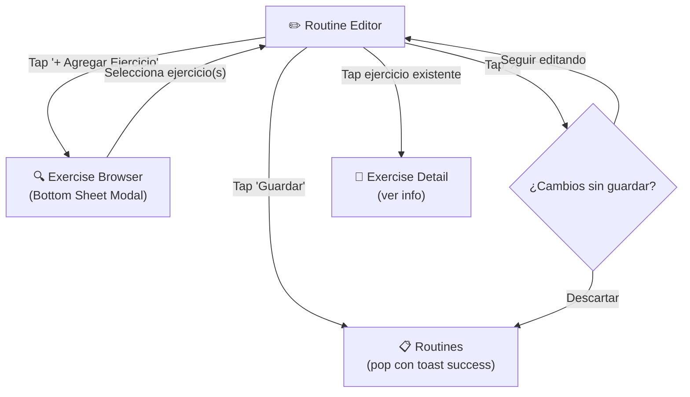

---

### 5.4 ⭐ Workout Screen (Stack Push — Pantalla Principal)

**Pantalla más importante** — diseñada para uso en gimnasio con manos sudadas.

**Layout**: ScrollView vertical. Header sticky con timer. Bottom bar sticky con acciones.

#### Componentes de la pantalla Workout Screen

| #   | Componente             | Descripción                                                                                                                                                                                                             |
| --- | ---------------------- | ----------------------------------------------------------------------------------------------------------------------------------------------------------------------------------------------------------------------- |
| 1   | **Header sticky**      | Botón `X` (cancelar con confirmación). Centro: nombre de rutina + índice ejercicio. Botón der: `Focus` (modo focus).                                                                                                    |
| 2   | **Progress indicator** | Barra de progreso horizontal: ejercicio actual / total ejercicios. Color `primary`.                                                                                                                                     |
| 3   | **Rest Timer chip**    | Chip superior `"DESCANSO: Xs"` visible solo cuando el temporizador está activo.                                                                                                                                         |
| 4   | **Exercise Section**   | Para no-superset: ejercicio único con animación slide (FadeInRight/Left). Para superset: carrusel horizontal con tabs. Ver detalle abajo.                                                                               |
| 5   | **Bottom bar sticky**  | 4 botones: `←` Anterior, `+` Añadir ejercicio, `⏳` Rest timer (Hourglass animado cuando activo), `→` "Sig. Ejercicio" / "Finalizar". Al finalizar: `isFinishing=true` → botón muestra "Guardando..." y se deshabilita. |
| 6   | **PR detection**       | Los PRs se detectan en batch al finalizar en `RecordAllSetsUseCase`. Los resultados se pasan como params JSON a `summary.tsx` para mostrar badges.                                                                      |

#### Detalle de `ExerciseSection`

```text
┌─────────────────────────────────────────────┐
│  ┌──────────────┐                            │
│  │  [WebP anim] │  Bench Press               │
│  │   120x120    │  Pecho · Compound           │
│  └──────────────┘  Peso anterior: 80 kg       │
│                    💡 Sugerido: 82.5 kg        │
│                                               │
│  ┌─ Calentamiento sugerido ──────────────┐   │
│  │  🔥 Frío → 3 series de calentamiento   │   │
│  │    40% (32.5kg) × 12  ·  60% × 8  ·   │   │
│  │    80% × 4                              │   │
│  │  [Usar calentamiento] [Saltar]          │   │
│  └────────────────────────────────────────┘   │
│                                               │
│  ─── Sets ───────────────────────────────    │
│  #   PESO      REPS    TIPO      RIR    ✔   │
│  1   [82.5]    [10]    Normal    [2]    ☑   │
│  2   [82.5]    [10]    Normal    [1]    ☑   │
│  3   [82.5]    [ _]    Normal    [ ]    ☐   │
│                                               │
│  [+ Agregar Set]                              │
│                                               │
│  Notas del ejercicio: [________________]      │
├─────────────────────────────────────────────┤
│  [Skip ejercicio]                             │
└─────────────────────────────────────────────┘
```

##### Detalle de `SetRow`

| Elemento            | Comportamiento                                                                                                                                                                                                                                            |
| ------------------- | --------------------------------------------------------------------------------------------------------------------------------------------------------------------------------------------------------------------------------------------------------- |
| **#**               | Número de set (auto-incrementa). Tap → alterna entre Normal y Warmup.                                                                                                                                                                                     |
| **PESO**            | Input numérico, teclado decimal. Placeholder: peso histórico de ese índice de set (del último workout). Long-press → Plate Calculator modal. `fontVariant: 'tabular-nums'`                                                                                |
| **REPS**            | Input numérico, teclado entero. Pre-rellenado con target reps de la rutina                                                                                                                                                                                |
| **✔**               | Checkbox. Tap → `Keyboard.dismiss()` + marcar set completado en Zustand (sin llamada al backend). Animación: scale 0.95→1 (150ms spring). Haptic `Medium`. Inicia rest timer. Los datos se persisten solo al finalizar el entrenamiento.                  |
| **Swipe-to-delete** | Swipe hacia la izquierda revela botón rojo "Eliminar" detrás del row (PanGestureHandler + Reanimated). Si supera el 40% del ancho → trigger `Alert.alert` de confirmación. Si no supera → snap back. Trash button visible como fallback de accesibilidad. |

> [!IMPORTANT]
> **Persistencia diferida**: Los sets completados se almacenan en el store Zustand (`useActiveWorkout`). La escritura a la base de datos ocurre **únicamente al presionar "Finalizar"** mediante `RecordAllSetsUseCase` en una transacción atómica. Esto elimina los "repeticiones fantasma" por toggle rápido y mejora la consistencia de datos.

##### Superset visual — Carrusel horizontal

Cuando `currentExercise.supersetGroup != null`, la pantalla cambia el layout de ejercicio único a un **carrusel horizontal con tabs**:

```text
┌─ Tabs ──────────────────────────────────────┐
│  [Bench Press ●]  [Incline Fly]  [Cable Fly] │
└─────────────────────────────────────────────┘
┌─ Página del ejercicio activo ───────────────┐
│  Bench Press                                 │
│  #   KG     REPS   ✔                        │
│  1  [80]   [10]   ☑                        │
│  2  [80]   [ _]   ☐                        │
└─────────────────────────────────────────────┘
```

**Comportamiento del carrusel:**

- Tabs superiores indican qué ejercicio del superset está visible. Tab activo con fondo `$primary`.
- Tap en tab → scroll programático a esa página.
- Al completar el **último set** de un ejercicio: rotación circular automática — el ejercicio actual se mueve al final del orden visual; el siguiente queda en primer plano. Scroll automático a posición 0.
- Estado local `supersetOrder: string[]` controla el orden visual sin modificar el store global `exercises`.
- La rotación solo ocurre al completar el último set (no en sets intermedios).

#### Menú overflow (•••)

| Opción                  | Acción                                      |
| ----------------------- | ------------------------------------------- |
| Reordenar ejercicios    | Abre modo drag & drop para cambiar orden    |
| Añadir ejercicio        | Abre **Exercise Browser**                   |
| Añadir notas al workout | Abre input de notas                         |
| Cancelar entrenamiento  | Confirmación destructiva → descarta workout |

#### Flujos desde Workout Screen

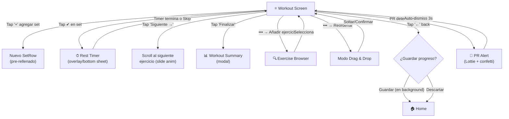

---

### 5.5 📊 Workout Summary (Modal — Post-workout)

**Función**: Resumen al finalizar un entrenamiento.

**Layout**: Modal `presentation: "formSheet"` con `sheetAllowedDetents: [0.75, 1.0]`.

#### Componentes

| #   | Componente                | Descripción                                                                                                                    |
| --- | ------------------------- | ------------------------------------------------------------------------------------------------------------------------------ |
| 1   | **Header**                | "¡Entrenamiento Completado!" + ícono `CheckCircle` (success color). Animación Lottie de celebración (sutil, 1s).               |
| 2   | **Métricas principales**  | Grid 2×2: Duración (`HH:MM:SS`), Volumen total (kg), Sets completados, Ejercicios realizados.                                  |
| 3   | **Records personales**    | Lista de PRs rotos en esta sesión. Cada PR: ícono `Trophy`, tipo (max weight/max reps/1RM), valor, ejercicio. Color `success`. |
| 4   | **Ejercicios realizados** | Lista colapsable: nombre + sets × reps × peso. Ejercicios skipped en gris.                                                     |
| 5   | **Input notas**           | "¿Cómo fue el entrenamiento?" TextInput multiline.                                                                             |
| 6   | **Botón "Cerrar"**        | CTA primario. Pop modal → Home con toast "Entrenamiento guardado".                                                             |

#### Flujos desde Workout Summary

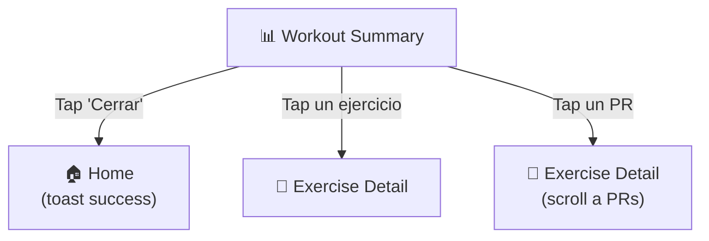

---

### 5.6 🔍 Exercise Browser (Bottom Sheet Modal)

**Función**: Buscar, filtrar y seleccionar ejercicios del catálogo.

**Layout**: `@gorhom/bottom-sheet` con `snapPoints: ['75%', '100%']`. Sticky search bar arriba.

#### Componentes Exercise Browser

| #   | Componente                    | Descripción                                                                                                                                                                                                  |
| --- | ----------------------------- | ------------------------------------------------------------------------------------------------------------------------------------------------------------------------------------------------------------ |
| 1   | **Search bar**                | Input con ícono `Search` (Lucide). Placeholder: "Buscar ejercicios...". Debounce 300ms. Clear button.                                                                                                        |
| 2   | **Filtros rápidos**           | ScrollView horizontal de chips: **por músculo** (Pecho, Espalda... ) y **por equipo** (Barra, Máquina...). Multi-select. Al Sustituir, el filtro muscular se pre-inyecta automáticamente.                    |
| 3   | **Lista de ejercicios**       | FlashList de `ExerciseListItem`. Al ubicar reemplazos, se divide en **✨ Alternativas Sugeridas** (mismo músculo, distinto equipo) y **Todos los ejercicios**. Cada item: animación WebP, metadata y badges. |
| 4   | **Botón "+ Crear Ejercicio"** | Al final de la lista (o si búsqueda no tiene resultados). Abre **Exercise Creator** (form modal).                                                                                                            |
| 5   | **Header de sección**         | Agrupación por músculo principal si no hay filtro activo.                                                                                                                                                    |

#### Detalle de `ExerciseListItem`

```text
┌──────────────────────────────────────────┐
│  [WebP]  Bench Press                      │
│  40×40   Pecho · Barra · Compound         │
│          ▸ Tap para seleccionar           │
└──────────────────────────────────────────┘
```

- **Tap** → selecciona/deselecciona (checkmark animado). Si viene de Routine Editor: selección múltiple. Si viene de Workout: inserción directa.
- **Long press** → abre **Exercise Detail** en preview sin cerrar el browser.

#### Empty State (búsqueda sin resultados)

"No se encontraron ejercicios" + "¿Querés crear uno personalizado?" + botón CTA.

#### Flujos desde Exercise Browser

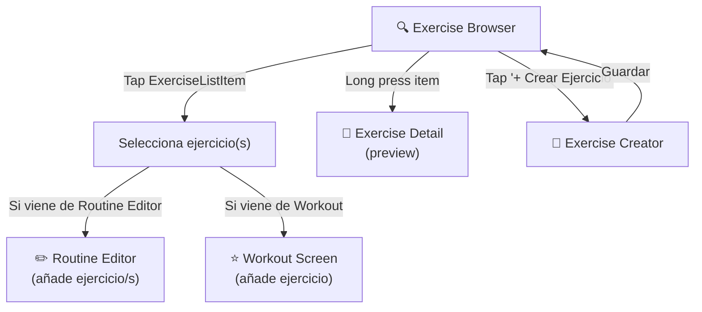

---

### 5.7 📝 Exercise Creator / Editor (Modal)

**Función**: Crear o editar un ejercicio personalizado.

**Layout**: Modal `presentation: "formSheet"`.

#### Componentes Exercise Creator

| #   | Componente                        | Descripción                                                                                     |
| --- | --------------------------------- | ----------------------------------------------------------------------------------------------- |
| 1   | **Header**                        | "Nuevo Ejercicio" / "Editar Ejercicio". Botón izq: Cancelar. Botón der: Guardar.                |
| 2   | **Input nombre**                  | TextInput con label "Nombre del ejercicio \*". Validación: requerido, min 2 chars.              |
| 3   | **Selector músculos primarios**   | Multi-select chips de `MuscleGroup`. Al menos 1 requerido.                                      |
| 4   | **Selector músculos secundarios** | Multi-select chips de `MuscleGroup`. Opcional.                                                  |
| 5   | **Selector equipo**               | Single-select segmented control: Barra, Mancuernas, Máquina, Cable, Peso Corporal, Banda, Otro. |
| 6   | **Tipo de ejercicio**             | Segmented: Compound / Aislamiento.                                                              |
| 7   | **Incremento de peso**            | Input numérico con stepper. Default: 2.5 kg. Label: "Incremento mínimo de peso".                |
| 8   | **Descripción**                   | TextInput multiline, label "Descripción (opcional)".                                            |

---

### 5.8 📄 Exercise Detail (Stack Push)

**Función**: Ver información completa de un ejercicio y su historial.

**Layout**: ScrollView con header transparente y animación parallax en la imagen.

#### Componentes Exercise Detail

| #   | Componente              | Descripción                                                                                                                   |
| --- | ----------------------- | ----------------------------------------------------------------------------------------------------------------------------- |
| 1   | **Animación WebP hero** | Imagen/animación del ejercicio a 200×200 con parallax al scroll. Si no hay animación: placeholder SVG anatómico.              |
| 2   | **Nombre y metadata**   | Nombre ejercicio (H1), tipo (badge compound/isolation), equipo (badge).                                                       |
| 3   | **Músculos**            | Primarios (badges `primary` color) + Secundarios (badges `secondary` color).                                                  |
| 4   | **Descripción**         | Texto expandible si es largo (> 3 líneas).                                                                                    |
| 5   | **Estadísticas**        | Card con: Max Peso, Max Reps, 1RM Estimado, Volumen Total, Total Sets. Datos de `ExerciseStats`. Empty state si no hay datos. |
| 6   | **Records Personales**  | Lista de PRs por tipo (max_weight, max_reps, max_volume, estimated_1rm) con fecha y valor. Ícono `Trophy`.                    |
| 7   | **Historial de sets**   | FlashList de sets recientes, agrupados por fecha de workout. Cada set: peso × reps, tipo, RIR.                                |
| 8   | **Gráfico de progreso** | Victory Line Chart: peso máximo por sesión a lo largo del tiempo. Toggle: peso / volumen / 1RM.                               |

#### Flujos desde Exercise Detail

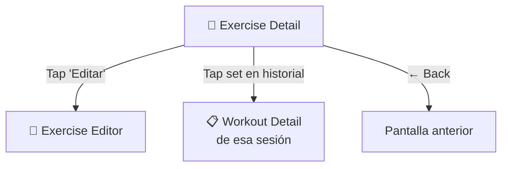

---

### 5.9 📜 History (Tab)

**Función**: Historial cronológico de todos los entrenamientos.

**Layout**: FlashList con sección headers por mes/semana.

#### Componentes History

| #   | Componente                  | Descripción                                                                                                                                                  |
| --- | --------------------------- | ------------------------------------------------------------------------------------------------------------------------------------------------------------ |
| 1   | **Header nativo**           | Título "Historial" (large title).                                                                                                                            |
| 2   | **Filtros de período**      | Segmented control (arriba): "Semana" / "Mes" / "Todo". Cambia la agrupación.                                                                                 |
| 3   | **Section headers**         | "Marzo 2026" / "Semana del 10 Mar" según filtro.                                                                                                             |
| 4   | **WorkoutCard por entry**   | Card con: fecha y hora (formateada: "Lun 15 Mar · 18:30"), nombre rutina (o "Libre"), duración, nº ejercicios, volumen total, badges de músculos trabajados. |
| 5   | **Swipe actions**           | Swipe izquierda: Eliminar (con confirmación destructiva).                                                                                                    |
| 6   | **Long press context menu** | "Ver detalle", "Repetir entrenamiento", "Eliminar".                                                                                                          |

#### Detalle de `WorkoutCard` en History

```text
┌──────────────────────────────────────────┐
│  Lun 15 Mar · 18:30                      │
│  Push Day                                 │
│  ⏱ 1h 12min  ·  📊 15,200 kg  ·  5 ej. │
│  [Pecho] [Tríceps] [Hombros]             │
│                                    🏆×2  │
└──────────────────────────────────────────┘
```

`🏆×2` = indica que se rompieron 2 PRs en ese workout.

#### Empty State

Lottie animation (calendario vacío) + "Todavía no hay entrenamientos" + botón "Empezar Ahora".

#### Flujos desde History

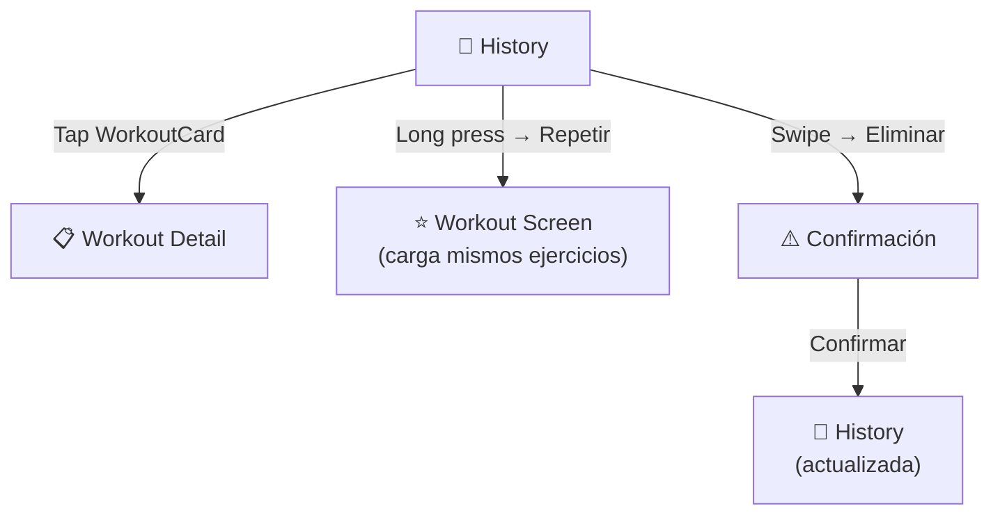

---

### 5.10 📋 Workout Detail (Stack Push)

**Función**: Ver el detalle completo de un entrenamiento pasado (solo lectura).

**Layout**: ScrollView.

#### Componentes Workout Detail

| #   | Componente               | Descripción                                                                                                                               |
| --- | ------------------------ | ----------------------------------------------------------------------------------------------------------------------------------------- |
| 1   | **Header**               | Fecha completa ("Lunes 15 de Marzo, 2026"). Botón der: `•••` (opciones).                                                                  |
| 2   | **Métricas principales** | Grid 2×2: Duración, Volumen total, Sets totales, Ejercicios. Mismo estilo que Workout Summary.                                            |
| 3   | **Notas del workout**    | Si existen, card con texto del usuario.                                                                                                   |
| 4   | **PRs obtenidos**        | Cards de PRs (si los hubo): tipo, valor, ejercicio. Color `success`.                                                                      |
| 5   | **Lista de ejercicios**  | Colapsable por ejercicio. Cada ejercicio: nombre, sets (tabla: #, peso, reps, tipo, RIR). Ejercicios skipped en gris con `Skipped` badge. |

#### Menú overflow (•••)

| Opción                     | Acción                                     |
| -------------------------- | ------------------------------------------ |
| Repetir este entrenamiento | Inicia workout nuevo con mismos ejercicios |
| Eliminar                   | Confirmación destructiva → pop + toast     |

---

### 5.11 📊 Stats (Tab)

**Función**: Visualización de progreso y estadísticas.

**Layout**: ScrollView con secciones seleccionables.

#### Componentes Stats

| #   | Componente                       | Descripción                                                                                                                                               |
| --- | -------------------------------- | --------------------------------------------------------------------------------------------------------------------------------------------------------- |
| 1   | **Header nativo**                | Título "Estadísticas" (large title).                                                                                                                      |
| 2   | **Period selector**              | Segmented control: "7 días" / "30 días" / "90 días" / "Todo". Afecta todos los gráficos.                                                                  |
| 3   | **Resumen numérico**             | Card horizontal con métricas del período: Total workouts, Total volumen, Tiempo total, PRs obtenidos.                                                     |
| 4   | **Volumen semanal**              | Victory Bar Chart. Eje X: días/semanas. Eje Y: volumen (kg). Colores accesibles. Tooltip on tap.                                                          |
| 5   | **Balance muscular**             | Victory Pie/Donut Chart. Distribución de volumen por músculo. Máx 8 segmentos (agrupar "Otros"). Leyenda interactiva. Tap segmento → highlight + tooltip. |
| 6   | **Frecuencia de entrenamiento**  | Heatmap estilo GitHub contributions. Cuadraditos por día, color = intensidad. Tooltip on tap: "3 Mar: 2 entrenamientos, 12,000 kg".                       |
| 7   | **Top ejercicios**               | FlashList (máx 10). Ranking por volumen total. Cada item: nombre, volumen, sets, 1RM. Tap → **Exercise Detail**.                                          |
| 8   | **Records Personales recientes** | Lista de los últimos 10 PRs. Cada PR: ejercicio, tipo, valor, fecha. Ícono `Trophy`.                                                                      |

#### Reglas de gráficos (skills `ui-ux-pro-max`)

- Leyendas visibles junto al gráfico, no debajo del scroll
- Tooltips en tap con valores exactos
- Empty state por gráfico con mensaje "Sin datos aún" + guidance
- Colores accesibles (no depender solo de rojo/verde)
- `fontVariant: 'tabular-nums'` en ejes numéricos
- Grid lines sutiles (`--border` con baja opacidad)
- Loading state: skeleton shimmer (nunca eje vacío)
- Skeleton → contenido: crossfade via `ContentReveal` (220ms fade-in content, 220ms fade-out skeleton con 50ms delay). Reduced motion: swap instantáneo.
- Máx 5 categorías en pie chart (agrupar resto como "Otros")

#### Flujos desde Stats

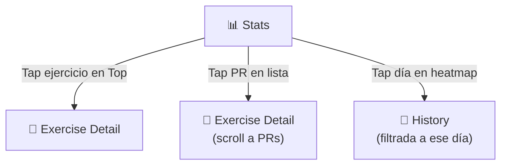

---

### 5.12 ⚙️ Settings (Tab)

**Función**: Configuración general, datos y preferencias.

**Layout**: ScrollView con secciones agrupadas (estilo iOS Settings).

#### Secciones y componentes

**Sección: Preferencias e Inventario**

| #   | Componente                  | Comportamiento                                                                                                       |
| --- | --------------------------- | -------------------------------------------------------------------------------------------------------------------- |
| 1   | **Unidad de peso**          | Switch/Segmented: `kg` / `lbs`. Cambio inmediato con toast "Unidad cambiada a lbs".                                  |
| 2   | **Tema**                    | Segmented: Claro / Oscuro / Sistema. Cambio en tiempo real.                                                          |
| 3   | **Descanso predeterminado** | Stepper con label: "Tiempo de descanso entre sets". Default 90s. Rango 30–300s en pasos de 15s.                      |
| 4   | **Inventario de Discos**    | Multi-select chips: 1.25, 2.5, 5, 10, 15, 20, 25 kg. Activa/desactiva los discos disponibles. Impacta en Plate Math. |
| 5   | **Peso de Barra Base**      | Segmented/Tabs: 10kg, 15kg, 20kg. Define peso por defecto sustraído en Plate Math.                                   |

**Sección: Peso Corporal**

| #   | Componente                 | Comportamiento                                                                     |
| --- | -------------------------- | ---------------------------------------------------------------------------------- |
| 4   | **Último peso registrado** | Card: "72.5 kg · hace 3 días". Si no hay registro: "Sin registros aún".            |
| 5   | **Botón "Registrar Peso"** | Abre form sheet con input numérico + date picker + notas. Guardar → toast success. |
| 6   | **Gráfico de peso**        | Victory Line Chart (últimos 90 días). Y-axis: peso. Tooltip on tap.                |
| 7   | **Historial**              | Lista colapsable de entradas: fecha, peso, notas. Swipe para eliminar.             |

**Sección: Backup & Exportación**

| #   | Componente                | Comportamiento                                                                                                         |
| --- | ------------------------- | ---------------------------------------------------------------------------------------------------------------------- |
| 8   | **Crear backup**          | Botón → progress indicator → success toast con tamaño del archivo. Exporta JSON.                                       |
| 9   | **Restaurar backup**      | Botón → file picker (JSON) → confirmación destructiva ("Esto reemplazará TODOS los datos") → progress → success/error. |
| 10  | **Exportar CSV**          | Botón → genera CSV → share sheet nativa del OS.                                                                        |
| 11  | **Google Drive (futuro)** | Botón gris/disabled con texto "Próximamente".                                                                          |

**Sección: Información**

| #   | Componente            | Comportamiento                                     |
| --- | --------------------- | -------------------------------------------------- |
| 12  | **Versión de la app** | Texto: "GymApp v1.0.0".                            |
| 13  | **Datos almacenados** | Texto: "X entrenamientos · Y ejercicios · Z sets". |

#### Flujos desde Settings

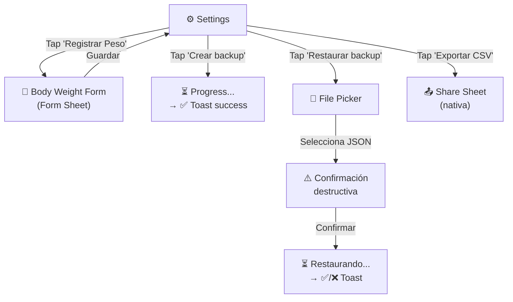

---

### 5.13 ⏱ Rest Timer (Overlay)

**Función**: Temporizador de descanso entre sets.

**Layout**: Bottom sheet o overlay centrado.

#### Componentes Rest Timer

| #   | Componente             | Descripción                                                                                        |
| --- | ---------------------- | -------------------------------------------------------------------------------------------------- |
| 1   | **Countdown circular** | Animación circular que se vacía. Números grandes centrales: `1:30`. `fontVariant: 'tabular-nums'`. |
| 2   | **Botones de ajuste**  | `-15s` y `+15s` a los lados del timer. Touch target ≥ 44pt.                                        |
| 3   | **Botón Skip**         | "Saltar descanso" debajo del timer.                                                                |
| 4   | **Próximo set info**   | Texto sutil: "Próximo: Set 3 · 82.5 kg".                                                           |

**Comportamiento**:

- Se activa automáticamente al marcar set como completado (✔).
- Tiempo: usa `restSeconds` del ejercicio en la rutina, o `defaultRestSeconds` de UserPreferences.
- Al terminar: haptic `Notification` + sonido sutil + auto-dismiss.
- Es interruptible: tocar cualquier input del workout lo minimiza.

---

## 6. Mapa de Navegación Completo

### 6.1 Árbol de navegación

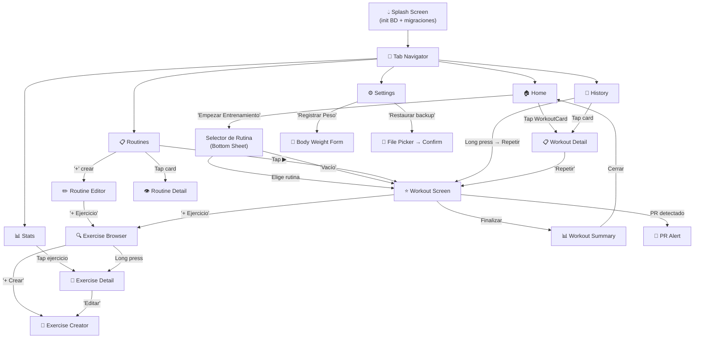

### 6.2 Flujo completo de entrenamiento

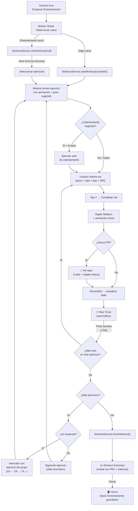

---

## 7. Gestión de estado — Zustand

### Stores principales

```typescript
// stores/workoutStore.ts
interface WorkoutState {
  activeWorkout: Workout | null;
  currentExerciseIndex: number;
  restTimerSeconds: number;
  isTimerRunning: boolean;

  // Actions
  startWorkout: (routineId: string) => Promise<void>;
  recordSet: (input: CreateSetInput) => Promise<void>;
  skipExercise: () => void;
  finishWorkout: () => Promise<void>;
  nextExercise: () => void;
  startRestTimer: () => void;
  resetRestTimer: () => void;
}
```

```typescript
// stores/exerciseStore.ts
interface ExerciseState {
  exercises: Exercise[];
  searchQuery: string;
  selectedMuscle: MuscleGroup | null;
  selectedEquipment: Equipment | null;
  filteredExercises: Exercise[];

  // Actions
  loadExercises: () => Promise<void>;
  setSearchQuery: (query: string) => void;
  setMuscleFilter: (muscle: MuscleGroup | null) => void;
  setEquipmentFilter: (equipment: Equipment | null) => void;
}
```

```typescript
// stores/statsStore.ts
interface StatsState {
  exerciseStats: Map<string, ExerciseStats>;
  dailyStats: DailyStats[];
  personalRecords: PersonalRecord[];

  // Actions
  loadExerciseStats: (exerciseId: string) => Promise<void>;
  loadDailyStats: (range: DateRange) => Promise<void>;
  loadPRs: (exerciseId: string) => Promise<void>;
}
```

> [!TIP]
> **Rendimiento con Zustand** (skill `vercel-react-native-skills`):
>
> - Usar selectores específicos: `useWorkoutStore(s => s.activeWorkout)`
> - Minimizar state subscriptions
> - Usar `dispatcher pattern` para callbacks estables en listas

---

## 8. Componentes reutilizables

### Design System y Librería Base

Para acelerar el desarrollo sin sacrificar rendimiento, no es necesario construir componentes atómicos (`Button`, `Input`) desde cero. Se recomienda utilizar una librería _headless_ o un _UI Kit_ moderno y envolverlo en nuestros propios componentes.

> [!TIP]
> **Recomendación de Librerías (Gratis):**
>
> - **[Tamagui](https://tamagui.dev/)**: Considerada la librería UI más rápida para React Native hoy en día. Su compilador extrae estilos estáticos, lo cual es ideal para apps como Hevy que necesitan mucho rendimiento. Incluye componentes interactivos gratuitos.
> - **[Gluestack UI](https://gluestack.io/)**: Componentes accesibles y sin estilo (_headless_) ideales si quieres crear un diseño visual propio muy customizado mediante tokens.
> - **[NativeWind](https://www.nativewind.dev/)**: Si prefieres usar clases de Tailwind CSS en React Native. Ideal combinado con componentes base custom.
> - **Componentes Modales**: Usar sí o sí **`@gorhom/bottom-sheet`** para todos los selectores de rutinas, buscadores (Exercise Browser) y paneles de configuración contextuales emergentes.

```text
src/
├── components/
│   ├── ui/                        ← Wrappers sobre Tamagui / Gluestack
│   │   ├── Button.tsx              ← Variantes: primary, secondary, danger
│   │   ├── Input.tsx               ← Numérico (peso/reps) con stepper
│   │   ├── Badge.tsx               ← PRs, etiquetas de músculo
│   │   ├── Toast.tsx               ← Wrapper de toast-message
│   │   └── Timer.tsx               ← Display de temporizador
│   ├── cards/
│   │   ├── ExerciseCard.tsx        ← Animación + nombre + músculo
│   │   ├── WorkoutCard.tsx         ← Resumen: fecha, duración, volumen
│   │   └── RoutineCard.tsx         ← Nombre + ejercicios count
│   ├── workout/
│   │   ├── SetRow.tsx              ← Input de peso + reps + checkbox
│   │   ├── WorkoutHeader.tsx       ← Timer + ejercicio actual
│   │   └── ExerciseSection.tsx     ← Grupo de sets por ejercicio
│   └── charts/
│       ├── ProgressChart.tsx       ← Victory Line Chart
│       ├── VolumeChart.tsx         ← Victory Bar Chart
│       └── EmptyChartState.tsx     ← Estado vacío con guidance
```

### Ejemplo: `SetRow`

```tsx
import { Pressable, Text, View } from "react-native";
import * as Haptics from "expo-haptics";
import Animated, {
  useAnimatedStyle,
  withSpring,
  useSharedValue,
} from "react-native-reanimated";

interface SetRowProps {
  setNumber: number;
  weight: number;
  reps: number;
  setType: "normal" | "warmup" | "dropset" | "failure";
  completed: boolean;
  onComplete: () => void;
  onWeightChange: (value: number) => void;
  onRepsChange: (value: number) => void;
  onTypeChange: (type: string) => void;
}

export function SetRow({
  setNumber,
  weight,
  reps,
  completed,
  onComplete,
  onWeightChange,
  onRepsChange,
}: SetRowProps) {
  const scale = useSharedValue(1);

  const animatedStyle = useAnimatedStyle(() => ({
    transform: [{ scale: scale.value }],
  }));

  const handleComplete = () => {
    scale.value = withSpring(0.95, {}, () => {
      scale.value = withSpring(1);
    });
    if (process.env.EXPO_OS === "ios") {
      Haptics.impactAsync(Haptics.ImpactFeedbackStyle.Medium);
    }
    onComplete();
  };

  return (
    <Animated.View
      style={[
        animatedStyle,
        {
          flexDirection: "row",
          alignItems: "center",
          padding: 12,
          gap: 12,
          borderRadius: 12,
          borderCurve: "continuous",
        },
      ]}
    >
      <Text style={{ fontVariant: ["tabular-nums"], width: 32 }}>
        {setNumber}
      </Text>
      {/* Weight & Reps inputs */}
      <Pressable
        onPress={handleComplete}
        style={{ minWidth: 44, minHeight: 44 }}
      >
        <Text>{completed ? "✔" : "☐"}</Text>
      </Pressable>
    </Animated.View>
  );
}
```

---

## 9. Animaciones de ejercicios

| Aspecto           | Especificación                             |
| ----------------- | ------------------------------------------ |
| **Formato**       | WebP animado                               |
| **Componente**    | `expo-image` (`<Image>`)                   |
| **Ubicación**     | `assets/exercises/animations/`             |
| **Carga**         | Lazy loading, bajo demanda                 |
| **Referencia BD** | `exercises.animation_path` (ruta relativa) |

```tsx
import { Image } from "expo-image";

<Image
  source={require(
    `../../assets/exercises/animations/${exercise.animationPath}`,
  )}
  style={{
    width: 200,
    height: 200,
    borderRadius: 16,
    borderCurve: "continuous",
  }}
  contentFit="contain"
  transition={200}
/>;
```

---

## 10. Diseño visual

### Paleta de colores

| Token              | Light Mode | Dark Mode |
| ------------------ | ---------- | --------- |
| `--background`     | `#FFFFFF`  | `#0F0F14` |
| `--surface`        | `#F8F9FA`  | `#1A1A24` |
| `--primary`        | `#3B82F6`  | `#60A5FA` |
| `--primary-muted`  | `#DBEAFE`  | `#1E3A5F` |
| `--text-primary`   | `#111827`  | `#F9FAFB` |
| `--text-secondary` | `#6B7280`  | `#9CA3AF` |
| `--success`        | `#10B981`  | `#34D399` |
| `--danger`         | `#EF4444`  | `#F87171` |
| `--border`         | `#E5E7EB`  | `#2D2D3A` |

> [!IMPORTANT]
> **Tokens semánticos obligatorios** — nunca usar hex hardcodeados directamente en componentes. Definir todos los colores como tokens en un ThemeProvider.

### Principios visuales

- **Minimalista**: centrado en datos, sin decoración innecesaria
- **Dark mode por defecto**: optimizado para uso en gimnasio (poca luz)
- **Espaciado 8dp**: sistema de grid consistente (4/8/12/16/24/32/48)
- **Border radius**: `borderRadius: 12` + `borderCurve: 'continuous'`
- **Sombras**: `boxShadow` CSS style (nunca legacy shadow/elevation)
- **Tipografía**: `fontVariant: ['tabular-nums']` en todos los números

---

## 11. Feedback al usuario

| Evento              | Feedback                                    | Timing       |
| ------------------- | ------------------------------------------- | ------------ |
| Completar set       | Haptic `Medium` + animación ✔               | < 100ms      |
| Nuevo PR            | Haptic `Heavy` + animación especial + toast | 150-300ms    |
| Error de validación | Toast error con mensaje claro               | 3-5s auto    |
| Borrar workout      | Diálogo de confirmación destructivo         | Requiere tap |
| Timer finalizado    | Haptic `Notification` + sonido sutil        | Inmediato    |
| Guardar rutina      | Toast success + animación                   | 3s auto      |

> [!NOTE]
> Feedback háptico solo en iOS (`process.env.EXPO_OS === 'ios'`). En Android usar ripple effect nativo.

---

## 12. Rendimiento

### Reglas críticas (skill `vercel-react-native-skills`)

| Prioridad   | Regla                         | Implementación                           |
| ----------- | ----------------------------- | ---------------------------------------- |
| 🔴 CRITICAL | Virtualizar listas            | FlashList para todas las listas          |
| 🔴 CRITICAL | Memoizar items de lista       | `React.memo` en `SetRow`, `ExerciseCard` |
| 🔴 CRITICAL | Estabilizar callbacks         | `useCallback` en handlers de listas      |
| 🟠 HIGH     | Animar solo transform/opacity | Nunca animar width/height/top/left       |
| 🟠 HIGH     | Usar Pressable                | Nunca `TouchableOpacity`                 |
| 🟡 MEDIUM   | Minimizar state subscriptions | Selectores específicos en Zustand        |
| 🟡 MEDIUM   | `useWindowDimensions`         | Nunca `Dimensions.get()`                 |

### Estrategia de carga inicial

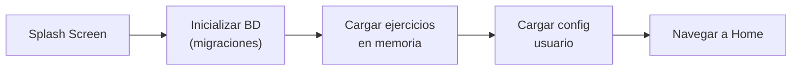

---

## 13. Accesibilidad

### Checklist obligatorio (Apple HIG + Material Design)

- [ ] Touch targets ≥ 44×44pt (iOS) / 48×48dp (Android)
- [ ] Contraste texto ≥ 4.5:1 (primario) / 3:1 (secundario)
- [ ] `accessibilityLabel` en todos los botones de ícono
- [ ] Focus order de VoiceOver coincide con el orden visual
- [ ] Soporte para Dynamic Type (texto escalable)
- [ ] `prefers-reduced-motion`: reducir/deshabilitar animaciones
- [ ] Dark mode contrastado independientemente del light mode
- [ ] Sin uso de color como único indicador (agregar ícono/texto)
- [ ] Labels visibles en todos los inputs (no solo placeholder)
- [ ] Confirmación antes de acciones destructivas

---

## 14. Arquitectura de carpetas completa

```text
Frontend/
├── app/
│   ├── (tabs)/
│   │   ├── history.tsx
│   │   ├── index.tsx
│   │   ├── routines.tsx
│   │   ├── settings.tsx
│   │   ├── stats.tsx
│   │   └── _layout.tsx
│   ├── (workouts)/
│   │   ├── exercise-browser.tsx
│   │   ├── rest-timer.tsx
│   │   ├── summary.tsx
│   │   ├── [active].tsx
│   │   └── _layout.tsx
│   ├── exercise/
│   │   └── [id].tsx
│   ├── history/
│   │   └── [id].tsx
│   ├── modal.tsx
│   ├── routine/
│   │   ├── create.tsx
│   │   └── [id].tsx
│   ├── settings/
│   │   ├── notifications.tsx
│   │   ├── privacy.tsx
│   │   └── profile.tsx
│   ├── stats/
│   │   └── weight.tsx
│   └── _layout.tsx
├── app.json
├── assets/
├── babel.config.js
├── components/
│   ├── cards/
│   │   ├── HistoryWorkoutCard.tsx
│   │   ├── loaders.tsx
│   │   ├── routine-exercise-row.tsx
│   │   ├── set-row-number-input.tsx
│   │   ├── set-row-rir-selector.tsx
│   │   └── set-row.tsx
│   ├── charts/
│   │   ├── ActivityGrid.tsx
│   │   ├── chartUtils.ts
│   │   ├── index.ts
│   │   ├── StatsLineChart.tsx
│   │   └── WeeklyVolumeBarChart.tsx
│   ├── feedback/
│   │   ├── AnimatedNumber.tsx
│   │   ├── ContentReveal.tsx
│   │   ├── EmptyStateIcon.tsx
│   │   └── skeleton-loader.tsx
│   ├── haptic-tab.tsx
│   ├── layout/
│   │   └── loaders.tsx
│   ├── onboarding/
│   │   └── ProfileSetupForm.tsx
│   ├── routine/
│   │   ├── RoutineEditorList.tsx
│   │   └── RoutineFormTemplate.tsx
│   ├── settings/
│   │   ├── SegmentedPicker.tsx
│   │   └── SettingItem.tsx
│   ├── stats/
│   │   ├── BodyWeightCard.tsx
│   │   ├── StatsSummaryGrid.tsx
│   │   └── StrengthProgressCard.tsx
│   ├── ui/
│   │   ├── AppButton.tsx
│   │   ├── AppIcon.tsx
│   │   ├── AppInput.tsx
│   │   ├── AppText.tsx
│   │   ├── badge.tsx
│   │   ├── card.tsx
│   │   ├── collapsible.tsx
│   │   ├── empty-state.tsx
│   │   ├── mini-player.tsx
│   │   ├── PressableCard.tsx
│   │   ├── Screen.tsx
│   │   ├── SearchBar.tsx
│   │   ├── TextureOverlay.tsx
│   │   ├── ToggleChip.tsx
│   │   ├── UndoToast.tsx
│   │   └── __tests__/
│   └── workout/
│       ├── ActiveWorkoutBottomBar.tsx
│       ├── ActiveWorkoutExerciseDetail.tsx
│       ├── ActiveWorkoutExercisePickerSheet.tsx
│       ├── ActiveWorkoutOptionsSheet.tsx
│       ├── ActiveWorkoutRestTimerChip.tsx
│       ├── PlateCalculatorModal.tsx
│       ├── PRCelebrationOverlay.tsx
│       ├── WorkoutExerciseSummaryList.tsx
│       ├── WorkoutHeader.tsx
│       ├── WorkoutSessionNoteSheet.tsx
│       └── __tests__/
...existing code...

> [!WARNING]
> **Nunca** colocar componentes, types, o utilidades en la carpeta `app/`. Es un anti-pattern de Expo Router. Solo rutas deben vivir ahí.

---

## 15. Pre-Delivery Checklist

Antes de entregar, verificar según skills `ui-ux-pro-max` y `building-native-ui`:

### Visual

- [ ] Sin emojis como íconos estructurales (usar Lucide)
- [ ] Tokens semánticos de color consistentes (no hex hardcoded)
- [ ] `borderCurve: 'continuous'` en todos los bordes redondeados
- [ ] `boxShadow` en lugar de legacy shadow/elevation

### Interacción

- [ ] Feedback háptico en acciones importantes
- [ ] Animaciones 150-300ms con easing spring/ease-out
- [ ] Disabled states claros y no interactivos
- [ ] Pressed states con scale sutil (0.95-1.05)

### Layout

- [ ] Safe areas respetadas (header, tab bar, bottom)
- [ ] Espaciado 8dp consistente
- [ ] `contentInsetAdjustmentBehavior="automatic"` en ScrollView/FlatList
- [ ] Verificado en teléfono pequeño (375px) + landscape

### Dark Mode

- [ ] Contraste primario ≥ 4.5:1
- [ ] Contraste secundario ≥ 3:1
- [ ] Bordes/divisores visibles en ambos temas
- [ ] Testeado independientemente del light mode

---

## Micro-Interacciones & Motion System

### Componentes de animación

| Componente         | Archivo                                  | Propósito                                                                                                                   |
| ------------------ | ---------------------------------------- | --------------------------------------------------------------------------------------------------------------------------- |
| **PressableCard**  | `components/ui/PressableCard.tsx`        | Wrapper con press feedback premium: scale 0.985 + shadow morph + translateY. Haptic en iOS. Reduced motion: opacity nativa. |
| **AnimatedNumber** | `components/feedback/AnimatedNumber.tsx` | Count-up animado para valores numéricos. Props: `value`, `duration`, `formatter`, `variant`, `color`. Maneja null→"—".      |
| **EmptyStateIcon** | `components/feedback/EmptyStateIcon.tsx` | Floating ambient animation para estados vacíos. Loop: translateY 0→-2→0 + opacity 1→0.7→1 (4s). Reduced motion: estático.   |
| **ContentReveal**  | `components/feedback/ContentReveal.tsx`  | Crossfade skeleton→content: 220ms fade-in, 220ms fade-out con 50ms delay.                                                   |

### Micro-interacciones implementadas

| Área               | Comportamiento                                                                                        | Archivo                                 |
| ------------------ | ----------------------------------------------------------------------------------------------------- | --------------------------------------- |
| **AppButton**      | Press: scale→0.96, release: spring back. Disabled/loading: sin animación.                             | `components/ui/AppButton.tsx`           |
| **Dashboard**      | Stagger FadeInDown (0→320ms, 80ms step). Cards en PressableCard. ContentReveal con DashboardSkeleton. | `app/(tabs)/index.tsx`                  |
| **Set completion** | Completing: pop scale 1.08 + green flash overlay. Uncompleting: press→1 sin pop.                      | `components/cards/set-row.tsx`          |
| **Progress bar**   | Flash blanco (opacity 0.6→0) al avanzar de ejercicio.                                                 | `components/workout/WorkoutHeader.tsx`  |
| **Stats grid**     | AnimatedNumber count-up en métricas semanales.                                                        | `components/stats/StatsSummaryGrid.tsx` |
| **Routines cards** | Opacity press feedback (0.7) en zona de info.                                                         | `app/(tabs)/routines.tsx`               |
| **Empty states**   | EmptyStateIcon flotante en routines (Dumbbell) y history (History).                                   | `routines.tsx`, `history.tsx`           |

### Motion tokens (`@/constants/motion`)

| Categoría     | Token                                      | Valor                               |
| ------------- | ------------------------------------------ | ----------------------------------- |
| **Durations** | `instant/fast/normal/slow/hero`            | 80/150/220/320/520 ms               |
| **Springs**   | `snappy`                                   | damping:14, stiffness:240, mass:0.9 |
|               | `bounce`                                   | damping:12, stiffness:200, mass:0.8 |
|               | `subtle`                                   | damping:20, stiffness:120, mass:1.0 |
| **Scales**    | `press/micro/pop`                          | 0.96/1.03/1.08                      |
| **Easings**   | `standard/decelerate/accelerate/symmetric` | Bezier curves                       |

### Regla de reduced motion

Todas las animaciones respetan `useMotion().isReduced`. Cuando está activo: springs→instant, entering→fade(0ms), escalas→1, ambient→estático.
