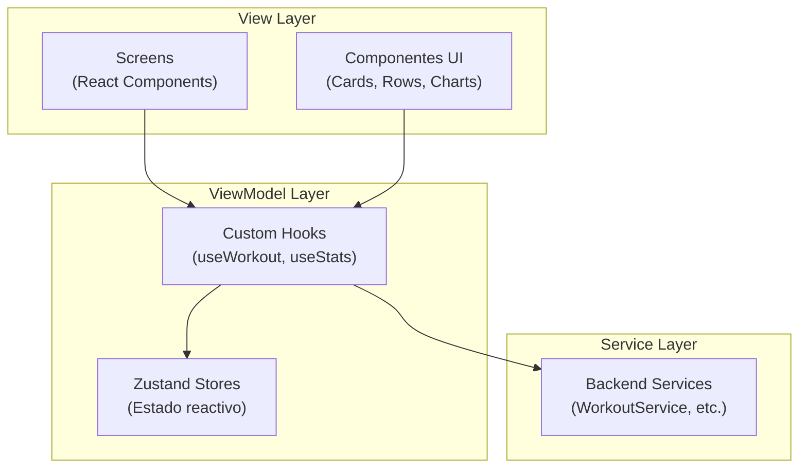
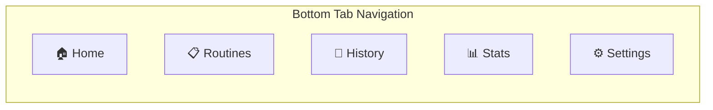
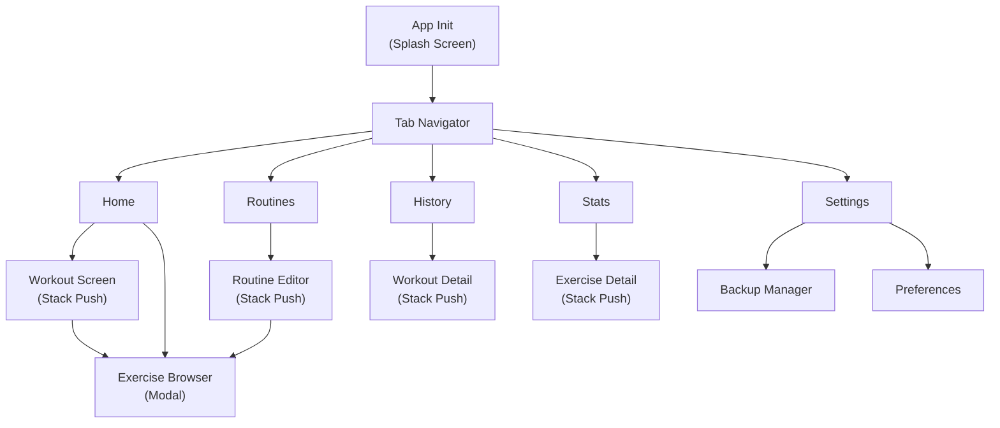
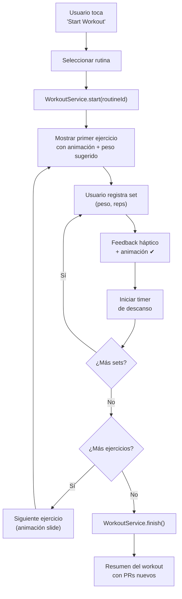
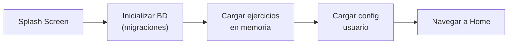

# Especificación Técnica – Frontend

## Aplicación Personal de Entrenamiento (estilo Hevy)

---

## 1. Objetivo del Frontend

El frontend es responsable de:

- Renderizar la interfaz de usuario
- Gestionar interacciones y navegación
- Controlar animaciones, temporizadores y feedback háptico
- Manejar estado visual y transiciones entre pantallas
- Conectarse con el backend local vía Services/Hooks

> [!IMPORTANT]
> El frontend **no debe contener lógica de negocio**. Toda lógica reside en el backend local (ver `Back.md`). El frontend solo consume Services.

### Principios de diseño

| Principio              | Implementación                                    |
| ---------------------- | ------------------------------------------------- |
| **Rápido**             | FlashList, memoización, lazy loading              |
| **Reactivo**           | Zustand + re-renders mínimos                      |
| **Accesible**          | Touch targets ≥44pt, contraste ≥4.5:1, VoiceOver  |
| **Offline-first**      | Todo funciona sin conexión                        |
| **Fácil de mantener**  | MVVM + componentes reutilizables                  |

---

## 2. Stack tecnológico

| Tecnología                         | Uso                                      |
| ---------------------------------- | ---------------------------------------- |
| **React Native + Expo**            | Framework principal                      |
| **TypeScript**                     | Lenguaje (modo `strict`)                 |
| **Expo Router**                    | Navegación file-based                    |
| **Zustand**                        | Estado global                            |
| **Tamagui / NativeWind**           | **NUEVO:** Sistema de UI y estilos (Plantillas/Componentes gratis y de alto rendimiento) |
| **@gorhom/bottom-sheet**           | **NUEVO:** Bottom sheets nativos a 60fps (Buscador, Ajustes) |
| **React Native Reanimated**        | Animaciones UI thread                    |
| **lottie-react-native**            | **NUEVO:** Animaciones complejas (celebración de PRs, onboarding) |
| **FlashList**                      | Listas de alto rendimiento               |
| **Victory Native**                 | Gráficos de estadísticas                 |
| **Lucide React Native**            | Sistema de iconos (SVG consistente)      |
| **expo-haptics**                   | Feedback háptico                         |
| **expo-image**                     | Imágenes optimizadas + WebP animado      |
| **react-native-toast-message**     | Notificaciones toast                     |

> [!NOTE]
> **Preferencias de librería** según skill `building-native-ui`:
> - `expo-image` en lugar de `<Image>` nativo
> - `Pressable` en lugar de `TouchableOpacity`
> - `process.env.EXPO_OS` en lugar de `Platform.OS`
> - Inline styles en lugar de `StyleSheet.create` (salvo estilos reutilizados)

---

## 2.1 Desglose y Propósito de cada Librería

Para evitar redundancias y mantener un desarrollo limpio, aquí se detalla el uso exclusivo de cada librería a lo largo de la app:

### Sistema Base y Estructura
- **`expo` / `react-native`**: Motor base y acceso a APIs del sistema operativo (teclado, portapapeles, dimensiones).
- **`expo-router`**: Gestiona **toda la navegación**, incluyendo las Tabs del menú inferior y el Stack (pila) de pantallas superpuestas (ej: ir de Home a Workout Screen). Todo vive bajo la carpeta `app/`.
- **`zustand`**: Gestión del **estado global sincrónico prestablecido** como el temporizador de descanso, el entrenamiento activo (`workoutStore`), o los filtros seleccionados (`exerciseStore`). *No usar para estados locales UI (ej. abrir/cerrar un popup).*

### UI y Estilos (Look and Feel)
- **`tamagui` & `@tamagui/core`**: Sistema de diseño principal. Construcción de componentes atómicos (Buttons, Inputs, Cards). Utiliza tokens de diseño definidos (colores, espaciado `8dp`) para compilar estilos nativos eficientes en lugar del viejo `StyleSheet.create`.
- **`lucide-react-native`**: **Única fuente de íconos**. Utilizada en botones, menús y Tabs. *Prohibido usar emojis estructurales o mezclar librerías de íconos.*
- **`expo-font`**: Utilizada para cargar fuentes modernas (Inter, Roboto) y crucial para aplicar la regla `fontVariant: ['tabular-nums']` en textos numéricos fluctuantes (pesos, cronómetros).

### Listas de Rendimiento Crítico
- **`@shopify/flash-list`**: Obligatorio para **todas las listas largas o dinámicas** por su superioridad técnica (reemplaza a FlatList).
  - *Uso obligatorio en:* Pantalla de *Routines*, *History*, buscador del *Exercise Browser*, y la lista de Sets (`SetRow`) en la *Workout Screen*.

### Interfaz Avanzada y Navegación Overlay
- **`@gorhom/bottom-sheet`**: Exclusivo para modales que emergen desde la base a 60fps.
  - *Casos:* **Exercise Browser** (el modal para buscar/agregar ejercicios), selectores rápidos u opciones contextuales (long-press en History).
- **`react-native-safe-area-context`**: Fundamental para evitar que los elementos de UI queden bloqueados por el "Notch/Isla Dinámica" en iOS o las barras de navegación en Android.

### Interacción y Sensaciones Físicas (Feedback)
- **`expo-haptics`**: Feedback físico al usuario en momentos clave (vibración).
  - *Casos:* `Medium` al completar un Set (check ✔). `Notification` al finalizar el temporizador. `Heavy` al romper un récord personal (PR).
- **`react-native-toast-message`**: Feedback visual rápido y no bloqueante (Ej: "Rutina guardada con éxito" o alertas de error de formulario).

### Animaciones
- **`react-native-reanimated`**: Animaciones fluidas atadas al hilo de la UI. Microinteracciones.
  - *Casos:* El efecto de presionado del check en `SetRow`, transiciones de Drag & Drop, o el desplazamiento de sliders/barras de progreso.
- **`lottie-react-native`**: Animaciones vectoriales pre-renderizadas no atadas al estado interactivo.
  - *Casos:* Celebraciones grandes de PRs, onboarding, o `EmptyChartState` súper visuales.

### Ejercicios y Visualización de Datos
- **`expo-image`**: Utilizada para cargar los assets de imágenes y, lo más importante, las **animaciones WebP de los ejercicios** (ej. mostrar un press banca en loop dentro del *Exercise Detail* y el *Workout Screen*) gracias a su carga bajo demanda (lazy load).
- **`victory-native`**: Exclusivo para el tab de **Stats**. Renderiza los gráficos de progreso (torta de balance muscular, barras del volumen levantado, o línea de estimación 1RM).

### Utilidades y Lógica Liviana
- **`date-fns`**: Parseo y formato de fechas limpios para toda la app (Ej: Formatear tiempos "Ayer a las 18:00", duraciones, etc.).
- **`zod`**: Validación robusta de formularios antes de hablar con los Services/Stores (Ej: Validar que el peso insertado es > 0, o que el nombre de rutina existe).
- **`expo-crypto`**: Empleado para **generar UUIDs ultrarrápidos** localmente, vital a la hora de asignar IDs temporales a nuevos sets o rutinas generados en pantalla antes de mandarlos a la base de datos backend.

---

## 3. Arquitectura frontend — MVVM



| Capa           | Responsabilidad                              | No debe hacer                    |
| -------------- | -------------------------------------------- | -------------------------------- |
| **View**       | Renderizar UI, capturar input del usuario    | Lógica de negocio, SQL           |
| **ViewModel**  | Gestionar estado, transformar datos para UI  | Acceso directo a BD              |
| **Service**    | Puente al backend local                      | Renderizar componentes           |

---

## 4. Estructura de navegación

### Tabs principales



### Mapa de navegación completo



### Implementación con Expo Router

```
app/
├── _layout.tsx                    ← NativeTabs / Bottom Tabs
├── (home,routines,history,stats,settings)/
│   ├── _layout.tsx                ← Stack Navigator compartido
│   ├── index.tsx                  ← Pantalla principal del tab
│   ├── workout/
│   │   └── [id].tsx               ← Workout activo / detalle
│   ├── routine/
│   │   ├── create.tsx
│   │   └── [id].tsx               ← Editor de rutina
│   ├── exercise/
│   │   └── [id].tsx               ← Detalle de ejercicio
│   └── exercise-browser.tsx       ← Modal: buscador de ejercicios
```

> [!TIP]
> Usar **grupos compartidos** `(home,routines,...)` permite que screens como `exercise/[id]` sean accesibles desde múltiples tabs sin duplicar rutas.

---

## 5. Pantallas principales

### 5.1 Home

**Función**: Acceso rápido al entrenamiento.

| Componente                  | Descripción                          |
| --------------------------- | ------------------------------------ |
| Botón "Start Workout"      | CTA primario, prominente             |
| Último entrenamiento        | Resumen del workout más reciente     |
| Rutinas recientes           | Lista horizontal, acceso rápido      |

---

### 5.2 Routines

**Función**: CRUD de rutinas.

| Componente                  | Descripción                          |
| --------------------------- | ------------------------------------ |
| Lista de rutinas            | FlatList con `ExerciseCard`          |
| Botón "Crear rutina"       | FAB o header button                  |
| Swipe actions               | Editar / Eliminar con confirmación   |

---

### 5.3 Routine Editor

**Función**: Crear/editar rutina.

| Componente                  | Descripción                          |
| --------------------------- | ------------------------------------ |
| Lista de ejercicios         | Drag & drop para reordenar          |
| Buscador de ejercicios      | Modal con filtros por músculo/equipo |
| Inputs por ejercicio        | Target sets + target reps            |

---

### 5.4 Workout Screen ⭐

**Pantalla más importante** — diseñada para uso en el gimnasio con manos ocupadas.

```
┌─────────────────────────────────┐
│  ← Back          Timer: 01:23  │
├─────────────────────────────────┤
│                                 │
│       [Animación WebP]          │
│        Bench Press              │
│                                 │
│  Peso anterior: 80 kg          │
│  Peso sugerido: 82.5 kg        │
│                                 │
├─────────────────────────────────┤
│  Set 1  [82.5 kg] [10 reps] ✔  │
│  Set 2  [82.5 kg] [10 reps] ☐  │
│  Set 3  [82.5 kg] [  reps] ☐  │
│                                 │
│     [+ Agregar Set]             │
│                                 │
├─────────────────────────────────┤
│  [Siguiente Ejercicio →]       │
└─────────────────────────────────┘
```

**Requisitos UX**:

- Touch targets ≥ 44pt para inputs de peso/reps
- Feedback háptico al completar set (`expo-haptics`)
- Animación de check al marcar ✔ (Reanimated, 150-300ms)
- Alerta con animación especial al romper un PR
- Temporizador de descanso persistente entre sets
- `fontVariant: 'tabular-nums'` en peso, reps y timer

---

### 5.5 Exercise Browser

**Función**: Buscar y filtrar ejercicios.

| Componente                  | Descripción                             |
| --------------------------- | --------------------------------------- |
| Search bar                  | `headerSearchBarOptions` en Stack       |
| Filtros                     | Por músculo, equipo (chips/segmented)   |
| Lista                       | FlashList con animación WebP + metadatos |

---

### 5.6 History

**Función**: Historial de entrenamientos.

| Componente                  | Descripción                          |
| --------------------------- | ------------------------------------ |
| Lista cronológica           | FlashList agrupada por fecha         |
| Card por workout            | Fecha, duración, volumen total       |
| Detalle                     | Stack push → resumen completo        |

---

### 5.7 Stats

**Función**: Visualización de progreso.

| Componente                  | Librería                             |
| --------------------------- | ------------------------------------ |
| Progreso por ejercicio      | Victory Native (Line Chart)          |
| Volumen semanal             | Victory Native (Bar Chart)           |
| PRs                         | Lista con badges/iconos              |

**Reglas de gráficos** (skill `ui-ux-pro-max`):

- Leyendas visibles junto al gráfico
- Tooltips en tap con valores exactos
- Empty state con mensaje "Sin datos aún"
- Colores accesibles (no solo rojo/verde)
- `fontVariant: 'tabular-nums'` en ejes numéricos

---

### 5.8 Settings

**Función**: Configuración y datos.

| Opción                      | Descripción                          |
| --------------------------- | ------------------------------------ |
| Backup                      | Crear / restaurar desde Google Drive |
| Exportar CSV                | Exportar historial                   |
| Preferencias                | Unidades (kg/lbs), tema, descanso    |

---

## 6. Flujo de entrenamiento



---

## 7. Gestión de estado — Zustand

### Stores principales

```typescript
// stores/workoutStore.ts
interface WorkoutState {
  activeWorkout: Workout | null;
  currentExerciseIndex: number;
  restTimerSeconds: number;
  isTimerRunning: boolean;

  // Actions
  startWorkout: (routineId: string) => Promise<void>;
  recordSet: (input: CreateSetInput) => Promise<void>;
  skipExercise: () => void;
  finishWorkout: () => Promise<void>;
  nextExercise: () => void;
  startRestTimer: () => void;
  resetRestTimer: () => void;
}
```

```typescript
// stores/exerciseStore.ts
interface ExerciseState {
  exercises: Exercise[];
  searchQuery: string;
  selectedMuscle: MuscleGroup | null;
  selectedEquipment: Equipment | null;
  filteredExercises: Exercise[];

  // Actions
  loadExercises: () => Promise<void>;
  setSearchQuery: (query: string) => void;
  setMuscleFilter: (muscle: MuscleGroup | null) => void;
  setEquipmentFilter: (equipment: Equipment | null) => void;
}
```

```typescript
// stores/statsStore.ts
interface StatsState {
  exerciseStats: Map<string, ExerciseStats>;
  dailyStats: DailyStats[];
  personalRecords: PersonalRecord[];

  // Actions
  loadExerciseStats: (exerciseId: string) => Promise<void>;
  loadDailyStats: (range: DateRange) => Promise<void>;
  loadPRs: (exerciseId: string) => Promise<void>;
}
```

> [!TIP]
> **Rendimiento con Zustand** (skill `vercel-react-native-skills`):
> - Usar selectores específicos: `useWorkoutStore(s => s.activeWorkout)`
> - Minimizar state subscriptions
> - Usar `dispatcher pattern` para callbacks estables en listas

---

## 8. Componentes reutilizables

### Design System y Librería Base

Para acelerar el desarrollo sin sacrificar rendimiento, no es necesario construir componentes atómicos (`Button`, `Input`) desde cero. Se recomienda utilizar una librería _headless_ o un _UI Kit_ moderno y envolverlo en nuestros propios componentes. 

> [!TIP]
> **Recomendación de Librerías (Gratis):**
> - **[Tamagui](https://tamagui.dev/)**: Considerada la librería UI más rápida para React Native hoy en día. Su compilador extrae estilos estáticos, lo cual es ideal para apps como Hevy que necesitan mucho rendimiento. Incluye componentes interactivos gratuitos.
> - **[Gluestack UI](https://gluestack.io/)**: Componentes accesibles y sin estilo (_headless_) ideales si quieres crear un diseño visual propio muy customizado mediante tokens.
> - **[NativeWind](https://www.nativewind.dev/)**: Si prefieres usar clases de Tailwind CSS en React Native. Ideal combinado con componentes base custom.
> - **Componentes Modales**: Usar sí o sí **`@gorhom/bottom-sheet`** para todos los selectores de rutinas, buscadores (Exercise Browser) y paneles de configuración contextuales emergentes.

```
src/
├── components/
│   ├── ui/                        ← Wrappers sobre Tamagui / Gluestack
│   │   ├── Button.tsx              ← Variantes: primary, secondary, danger
│   │   ├── Input.tsx               ← Numérico (peso/reps) con stepper
│   │   ├── Badge.tsx               ← PRs, etiquetas de músculo
│   │   ├── Toast.tsx               ← Wrapper de toast-message
│   │   └── Timer.tsx               ← Display de temporizador
│   ├── cards/
│   │   ├── ExerciseCard.tsx        ← Animación + nombre + músculo
│   │   ├── WorkoutCard.tsx         ← Resumen: fecha, duración, volumen
│   │   └── RoutineCard.tsx         ← Nombre + ejercicios count
│   ├── workout/
│   │   ├── SetRow.tsx              ← Input de peso + reps + checkbox
│   │   ├── WorkoutHeader.tsx       ← Timer + ejercicio actual
│   │   └── ExerciseSection.tsx     ← Grupo de sets por ejercicio
│   └── charts/
│       ├── ProgressChart.tsx       ← Victory Line Chart
│       ├── VolumeChart.tsx         ← Victory Bar Chart
│       └── EmptyChartState.tsx     ← Estado vacío con guidance
```

### Ejemplo: `SetRow`

```tsx
import { Pressable, Text, View } from 'react-native';
import * as Haptics from 'expo-haptics';
import Animated, {
  useAnimatedStyle,
  withSpring,
  useSharedValue,
} from 'react-native-reanimated';

interface SetRowProps {
  setNumber: number;
  weight: number;
  reps: number;
  completed: boolean;
  onComplete: () => void;
  onWeightChange: (value: number) => void;
  onRepsChange: (value: number) => void;
}

export function SetRow({
  setNumber, weight, reps, completed, onComplete,
  onWeightChange, onRepsChange,
}: SetRowProps) {
  const scale = useSharedValue(1);

  const animatedStyle = useAnimatedStyle(() => ({
    transform: [{ scale: scale.value }],
  }));

  const handleComplete = () => {
    scale.value = withSpring(0.95, {}, () => {
      scale.value = withSpring(1);
    });
    if (process.env.EXPO_OS === 'ios') {
      Haptics.impactAsync(Haptics.ImpactFeedbackStyle.Medium);
    }
    onComplete();
  };

  return (
    <Animated.View style={[animatedStyle, {
      flexDirection: 'row',
      alignItems: 'center',
      padding: 12,
      gap: 12,
      borderRadius: 12,
      borderCurve: 'continuous',
    }]}>
      <Text style={{ fontVariant: ['tabular-nums'], width: 32 }}>
        {setNumber}
      </Text>
      {/* Weight & Reps inputs */}
      <Pressable
        onPress={handleComplete}
        style={{ minWidth: 44, minHeight: 44 }}
      >
        <Text>{completed ? '✔' : '☐'}</Text>
      </Pressable>
    </Animated.View>
  );
}
```

---

## 9. Animaciones de ejercicios

| Aspecto           | Especificación                            |
| ----------------- | ----------------------------------------- |
| **Formato**       | WebP animado                              |
| **Componente**    | `expo-image` (`<Image>`)                  |
| **Ubicación**     | `assets/exercises/animations/`            |
| **Carga**         | Lazy loading, bajo demanda                |
| **Referencia BD** | `exercises.animation_path` (ruta relativa)|

```tsx
import { Image } from 'expo-image';

<Image
  source={require(`../../assets/exercises/animations/${exercise.animationPath}`)}
  style={{ width: 200, height: 200, borderRadius: 16, borderCurve: 'continuous' }}
  contentFit="contain"
  transition={200}
/>
```

---

## 10. Diseño visual

### Paleta de colores

| Token                | Light Mode       | Dark Mode        |
| -------------------- | ---------------- | ---------------- |
| `--background`       | `#FFFFFF`        | `#0F0F14`        |
| `--surface`          | `#F8F9FA`        | `#1A1A24`        |
| `--primary`          | `#3B82F6`        | `#60A5FA`        |
| `--primary-muted`    | `#DBEAFE`        | `#1E3A5F`        |
| `--text-primary`     | `#111827`        | `#F9FAFB`        |
| `--text-secondary`   | `#6B7280`        | `#9CA3AF`        |
| `--success`          | `#10B981`        | `#34D399`        |
| `--danger`           | `#EF4444`        | `#F87171`        |
| `--border`           | `#E5E7EB`        | `#2D2D3A`        |

> [!IMPORTANT]
> **Tokens semánticos obligatorios** — nunca usar hex hardcodeados directamente en componentes. Definir todos los colores como tokens en un ThemeProvider.

### Principios visuales

- **Minimalista**: centrado en datos, sin decoración innecesaria
- **Dark mode por defecto**: optimizado para uso en gimnasio (poca luz)
- **Espaciado 8dp**: sistema de grid consistente (4/8/12/16/24/32/48)
- **Border radius**: `borderRadius: 12` + `borderCurve: 'continuous'`
- **Sombras**: `boxShadow` CSS style (nunca legacy shadow/elevation)
- **Tipografía**: `fontVariant: ['tabular-nums']` en todos los números

---

## 11. Feedback al usuario

| Evento                    | Feedback                                  | Timing       |
| ------------------------- | ----------------------------------------- | ------------ |
| Completar set             | Haptic `Medium` + animación ✔             | < 100ms      |
| Nuevo PR                  | Haptic `Heavy` + animación especial + toast | 150-300ms   |
| Error de validación       | Toast error con mensaje claro             | 3-5s auto    |
| Borrar workout            | Diálogo de confirmación destructivo       | Requiere tap |
| Timer finalizado          | Haptic `Notification` + sonido sutil      | Inmediato    |
| Guardar rutina            | Toast success + animación                 | 3s auto      |

> [!NOTE]
> Feedback háptico solo en iOS (`process.env.EXPO_OS === 'ios'`). En Android usar ripple effect nativo.

---

## 12. Rendimiento

### Reglas críticas (skill `vercel-react-native-skills`)

| Prioridad  | Regla                             | Implementación                         |
| ---------- | --------------------------------- | -------------------------------------- |
| 🔴 CRITICAL| Virtualizar listas               | FlashList para todas las listas        |
| 🔴 CRITICAL| Memoizar items de lista          | `React.memo` en `SetRow`, `ExerciseCard` |
| 🔴 CRITICAL| Estabilizar callbacks            | `useCallback` en handlers de listas    |
| 🟠 HIGH    | Animar solo transform/opacity    | Nunca animar width/height/top/left     |
| 🟠 HIGH    | Usar Pressable                   | Nunca `TouchableOpacity`               |
| 🟡 MEDIUM  | Minimizar state subscriptions    | Selectores específicos en Zustand      |
| 🟡 MEDIUM  | `useWindowDimensions`            | Nunca `Dimensions.get()`              |

### Estrategia de carga inicial



---

## 13. Accesibilidad

### Checklist obligatorio (Apple HIG + Material Design)

- [ ] Touch targets ≥ 44×44pt (iOS) / 48×48dp (Android)
- [ ] Contraste texto ≥ 4.5:1 (primario) / 3:1 (secundario)
- [ ] `accessibilityLabel` en todos los botones de ícono
- [ ] Focus order de VoiceOver coincide con el orden visual
- [ ] Soporte para Dynamic Type (texto escalable)
- [ ] `prefers-reduced-motion`: reducir/deshabilitar animaciones
- [ ] Dark mode contrastado independientemente del light mode
- [ ] Sin uso de color como único indicador (agregar ícono/texto)
- [ ] Labels visibles en todos los inputs (no solo placeholder)
- [ ] Confirmación antes de acciones destructivas

---

## 14. Arquitectura de carpetas completa

```
src/
├── app/                           ← Expo Router (solo rutas)
│   ├── _layout.tsx
│   └── (tabs)/
│       ├── _layout.tsx
│       ├── index.tsx              ← Home
│       ├── routines.tsx
│       ├── history.tsx
│       ├── stats.tsx
│       └── settings.tsx
│
├── components/
│   ├── ui/                        ← Design system base
│   ├── cards/                     ← Cards reutilizables
│   ├── workout/                   ← Componentes de workout
│   └── charts/                    ← Gráficos Victory
│
├── stores/                        ← Zustand stores
│   ├── workoutStore.ts
│   ├── exerciseStore.ts
│   └── statsStore.ts
│
├── hooks/                         ← Custom hooks
│   ├── useWorkout.ts
│   ├── useExercises.ts
│   ├── useStats.ts
│   └── useRestTimer.ts
│
├── services/                      ← Puente al backend
│   ├── WorkoutService.ts
│   ├── ExerciseService.ts
│   ├── StatsService.ts
│   └── BackupService.ts
│
├── theme/                         ← Design tokens
│   ├── colors.ts
│   ├── spacing.ts
│   ├── typography.ts
│   └── ThemeProvider.tsx
│
├── types/                         ← Tipos compartidos
│   └── index.ts
│
└── assets/
    └── exercises/
        └── animations/            ← WebP animados
```

> [!WARNING]
> **Nunca** colocar componentes, types, o utilidades en la carpeta `app/`. Es un anti-pattern de Expo Router. Solo rutas deben vivir ahí.

---

## 15. Pre-Delivery Checklist

Antes de entregar, verificar según skills `ui-ux-pro-max` y `building-native-ui`:

### Visual
- [ ] Sin emojis como íconos estructurales (usar Lucide)
- [ ] Tokens semánticos de color consistentes (no hex hardcoded)
- [ ] `borderCurve: 'continuous'` en todos los bordes redondeados
- [ ] `boxShadow` en lugar de legacy shadow/elevation

### Interacción
- [ ] Feedback háptico en acciones importantes
- [ ] Animaciones 150-300ms con easing spring/ease-out
- [ ] Disabled states claros y no interactivos
- [ ] Pressed states con scale sutil (0.95-1.05)

### Layout
- [ ] Safe areas respetadas (header, tab bar, bottom)
- [ ] Espaciado 8dp consistente
- [ ] `contentInsetAdjustmentBehavior="automatic"` en ScrollView/FlatList
- [ ] Verificado en teléfono pequeño (375px) + landscape

### Dark Mode
- [ ] Contraste primario ≥ 4.5:1
- [ ] Contraste secundario ≥ 3:1
- [ ] Bordes/divisores visibles en ambos temas
- [ ] Testeado independientemente del light mode
